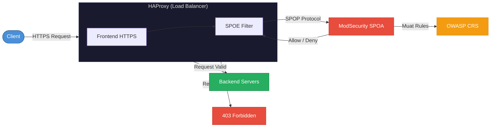
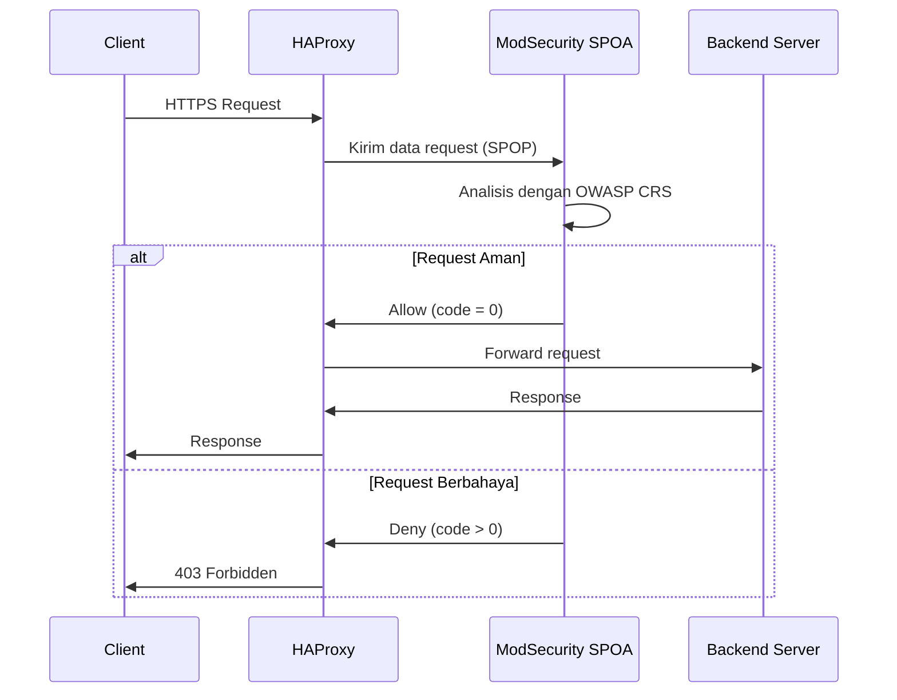

Keamanan aplikasi merupakan aspek krusial yang tidak dapat diabaikan, terutama ketika aplikasi telah dipublikasikan ke jaringan publik. Salah satu mekanisme pertahanan terdepan yang direkomendasikan oleh para praktisi keamanan adalah penerapan **Web Application Firewall (WAF)**.

Artikel ini membahas implementasi WAF menggunakan kombinasi **HAProxy**, **ModSecurity (SPOA)**, dan **OWASP Core Rule Set (CRS)** — sebuah arsitektur pertahanan yang terbukti efektif dalam melindungi aplikasi web dari berbagai vektor serangan.

<!--truncate-->

## Latar Belakang

HAProxy dikenal sebagai load balancer dengan performa tinggi. Namun, secara desain, HAProxy tidak dioptimalkan untuk melakukan inspeksi mendalam terhadap konten HTTP (*Deep Packet Inspection*). Untuk mengatasi keterbatasan ini, diperlukan komponen tambahan yang berfungsi sebagai mesin analisis keamanan — yaitu **ModSecurity**.

Karena ModSecurity pada umumnya beroperasi sebagai modul pada web server (seperti Nginx atau Apache), integrasi dengan HAProxy dilakukan melalui mekanisme **Stream Processing Offload Agent (SPOA)**. Dengan pendekatan ini, HAProxy mengirimkan data request ke agen ModSecurity yang berjalan secara terpisah untuk dianalisis.

## Arsitektur Sistem

Berikut adalah diagram arsitektur integrasi ketiga komponen tersebut:



## Komponen Utama

| Komponen | Fungsi |
|---|---|
| **HAProxy** | Berperan sebagai pintu gerbang utama (*reverse proxy* dan *load balancer*) |
| **ModSecurity SPOA** | Agen yang menjalankan engine ModSecurity untuk analisis request |
| **OWASP CRS** | Kumpulan aturan keamanan yang mendeteksi serangan umum (XSS, SQLi, LFI, dll.) |

## Langkah Implementasi

### 1. Menyiapkan ModSecurity SPOA

Gunakan container image `jcmoraisjr/modsecurity-spoa`. Engine ModSecurity akan menunggu pengiriman data dari HAProxy melalui protokol **SPOP** (*Stream Processing Offload Protocol*).

### 2. Memasang OWASP Core Rule Set

Pastikan file-file rules dari repository `coreruleset/coreruleset` dimuat ke dalam konfigurasi ModSecurity. Aturan-aturan ini yang akan mendeteksi pola-pola serangan yang telah teridentifikasi.

### 3. Konfigurasi HAProxy Frontend

Tambahkan blok `filter spoe` pada bagian frontend HAProxy:

```haproxy
frontend https-in
    bind *:443 ssl crt /etc/ssl/certs/site.pem
    filter spoe engine modsecurity config /etc/haproxy/modsec.conf
    http-request deny if { var(txn.modsec.code) -m int gt 0 }
    default_backend web-servers
```

### 4. Konfigurasi SPOE

Buat file `modsec.conf` untuk menghubungkan HAProxy dengan agen ModSecurity:

```haproxy
[modsecurity]
spoe-agent modsecurity-agent
    messages check-request
    option var-prefix modsec
    timeout hello      100ms
    timeout idle       30s
    timeout processing 500ms
    use-backend modsec-cluster

spoe-message check-request
    args method path query version headers payload
```

## Alur Pemrosesan Request



## Keunggulan Arsitektur Ini

1. **Pemisahan Tanggung Jawab (*Separation of Concerns*)** — Proses inspeksi keamanan dilakukan secara terpisah (*offloading*) sehingga load balancer HAProxy tetap dapat melayani traffic dengan performa optimal.

2. **Skalabilitas** — ModSecurity SPOA dapat di-*scale* secara independen sesuai dengan volume traffic yang perlu diinspeksi.

3. **Standar Industri** — OWASP CRS merupakan kumpulan aturan keamanan yang diakui secara global dan terus diperbarui oleh komunitas keamanan siber.

## Kesimpulan

Implementasi WAF menggunakan kombinasi HAProxy, ModSecurity SPOA, dan OWASP CRS merupakan pendekatan yang efektif untuk melindungi aplikasi web dari berbagai ancaman keamanan. Dengan arsitektur *offloading* ini, keamanan dan performa dapat berjalan secara beriringan tanpa saling mengorbankan.

:::tip Rekomendasi
Pastikan untuk selalu memperbarui OWASP CRS ke versi terbaru agar perlindungan terhadap vektor serangan baru tetap optimal.
:::
