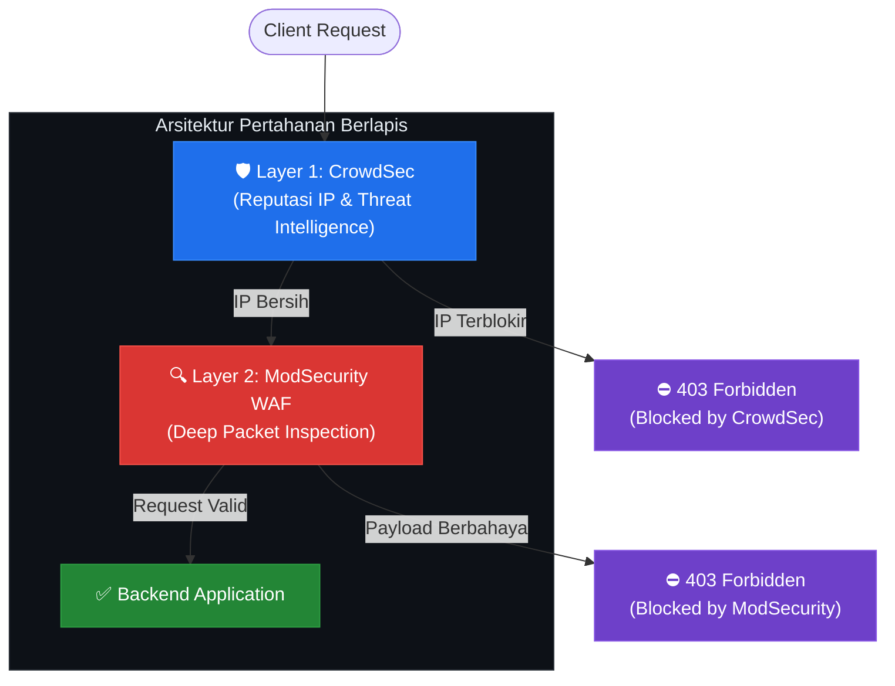
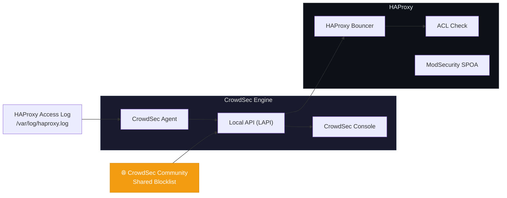

Setelah sebelumnya membahas implementasi WAF menggunakan HAProxy dan ModSecurity, artikel ini mengulas strategi peningkatan keamanan ke level yang lebih tinggi melalui penerapan **pertahanan berlapis (*Defense in Depth*)**. Dengan mengintegrasikan **CrowdSec** ke dalam arsitektur yang telah ada, sistem mampu memblokir serangan bahkan sebelum penyerang sempat mengirimkan payload berbahaya.

<!--truncate-->

## Mengapa CrowdSec Diperlukan?

Jika ModSecurity berfungsi sebagai mekanisme inspeksi konten (*Deep Packet Inspection*), maka CrowdSec berperan sebagai sistem intelijen ancaman (*Threat Intelligence*) yang memiliki basis data reputasi IP dari seluruh dunia.

CrowdSec menganalisis log dan mendeteksi perilaku mencurigakan seperti:
- **Brute force attack** — percobaan login berulang yang gagal
- **Port scanning** — pemindaian port untuk mencari celah keamanan
- **DDoS** — serangan distribusi yang bertujuan melumpuhkan layanan

:::info Keunggulan Komunitas
Apabila seorang pengguna CrowdSec mendeteksi serangan dari suatu IP, informasi tersebut akan dibagikan ke seluruh komunitas CrowdSec secara otomatis. Mekanisme ini dikenal sebagai ***Community-Powered Security***.
:::

## Arsitektur Pertahanan Berlapis



Dengan arsitektur ini, proses validasi request berjalan secara bertahap:

1. **Layer 1 — CrowdSec**: Memeriksa apakah IP pengirim terdaftar dalam *blocklist* atau menunjukkan pola perilaku mencurigakan berdasarkan analisis log. Jika teridentifikasi, request langsung ditolak.
2. **Layer 2 — ModSecurity WAF**: Jika IP dinyatakan bersih oleh CrowdSec, konten request (*payload*) akan diinspeksi oleh ModSecurity untuk mendeteksi SQL Injection, XSS, dan vektor serangan lainnya.

## Komponen Integrasi



### 1. Instalasi CrowdSec Agent

CrowdSec Agent bertugas membaca log HAProxy (`/var/log/haproxy.log`) dan mendeteksi anomali berdasarkan skenario (*scenarios*) yang telah dikonfigurasi.

### 2. Konfigurasi HAProxy Bouncer

Bouncer beroperasi di level HAProxy untuk menarik daftar IP yang harus diblokir dari CrowdSec Local API (LAPI).

Berikut contoh konfigurasi ACL pada HAProxy:

```haproxy
frontend https-in
    # Verifikasi blocklist dari CrowdSec
    acl is_blacklisted src -f /etc/haproxy/crowdsec_blacklist.lst
    http-request deny if is_blacklisted

    # Jika lolos CrowdSec, kirim ke ModSecurity SPOA
    filter spoe engine modsecurity config /etc/haproxy/modsec.conf
    http-request deny if { var(txn.modsec.code) -m int gt 0 }
    
    default_backend web-servers
```

## Perbandingan dengan Single-Layer Defense

| Aspek | ModSecurity Saja | CrowdSec + ModSecurity |
|---|---|---|
| **Inspeksi Konten** | ✅ Ya | ✅ Ya |
| **Reputasi IP** | ❌ Tidak | ✅ Ya |
| **Community Intelligence** | ❌ Tidak | ✅ Ya |
| **Efisiensi Resource** | Sedang | Tinggi (IP jahat diblokir lebih awal) |
| **Pembaruan Otomatis** | Manual | Otomatis (real-time) |

## Keunggulan Utama

1. **Efisiensi Resource** — Serangan dari IP yang telah teridentifikasi dalam blocklist CrowdSec langsung ditolak tanpa perlu diproses oleh ModSecurity SPOA, sehingga mengurangi beban komputasi.

2. **Pembaruan Real-time** — Basis data IP berbahaya diperbarui secara berkelanjutan oleh ribuan pengguna CrowdSec di seluruh dunia.

3. **Visibilitas Komprehensif** — Seluruh aktivitas ancaman dapat dipantau melalui CrowdSec Console dan CLI (`cscli`) yang menyediakan antarmuka yang intuitif.

## Kesimpulan

Penggabungan **ModSecurity** untuk inspeksi konten dan **CrowdSec** untuk reputasi IP pada **HAProxy** merupakan implementasi strategi *Defense in Depth* yang solid dan efisien. Arsitektur ini tidak hanya meningkatkan keamanan secara signifikan, tetapi juga mengoptimalkan penggunaan resource server.

:::tip Langkah Selanjutnya
Pertimbangkan untuk mendaftarkan instance CrowdSec Anda ke [CrowdSec Console](https://app.crowdsec.net/) untuk mendapatkan visibilitas yang lebih baik terhadap ancaman yang terdeteksi.
:::
