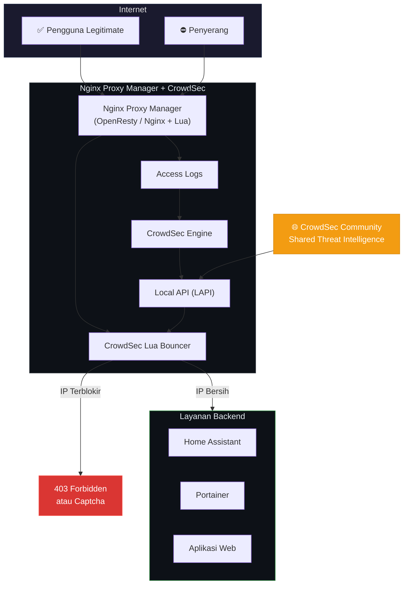
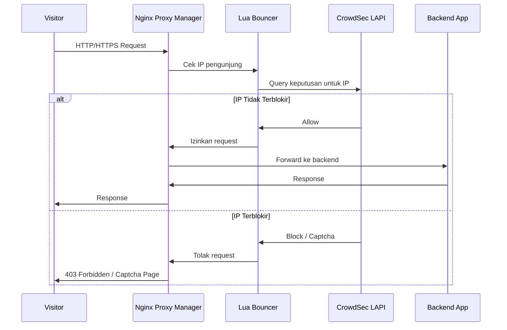

Bagi pengelola infrastruktur *self-hosting*, **Nginx Proxy Manager (NPM)** merupakan solusi yang sangat populer untuk mengatur *reverse proxy* melalui antarmuka grafis yang intuitif. Namun, kemudahan penggunaan tersebut perlu diimbangi dengan mekanisme keamanan yang memadai. Artikel ini membahas cara mengintegrasikan **CrowdSec** dengan Nginx Proxy Manager untuk membangun sistem pertahanan aktif terhadap ancaman siber.

<!--truncate-->

## Apa Itu Nginx Proxy Manager?

Nginx Proxy Manager (NPM) adalah antarmuka grafis (*GUI*) untuk Nginx yang memungkinkan konfigurasi *reverse proxy*, SSL certificate, dan *access list* tanpa perlu mengedit file konfigurasi Nginx secara manual. Meskipun sangat praktis, NPM secara bawaan tidak memiliki sistem pertahanan aktif yang kuat terhadap serangan *brute force*, *bot attack*, atau ancaman keamanan lainnya.

## CrowdSec sebagai Sistem Pertahanan Aktif

CrowdSec merupakan sistem keamanan kolaboratif modern yang menganalisis log aplikasi dan mendeteksi perilaku anomali secara real-time. Mekanisme kerjanya meliputi:

- **Deteksi Anomali** — Mengidentifikasi pola serangan seperti percobaan login berulang yang gagal
- **Keputusan Otomatis** — Secara otomatis memblokir IP yang teridentifikasi sebagai ancaman
- **Berbagi Intelijen** — Membagikan informasi ancaman ke seluruh komunitas pengguna CrowdSec

## Mekanisme Integrasi

Nginx Proxy Manager dibangun di atas **OpenResty** (Nginx + Lua), sehingga integrasi dengan CrowdSec dapat dilakukan melalui **CrowdSec Lua Bouncer**. Berikut alur kerjanya:

### Langkah-langkah Integrasi

1. **Parsing Log** — CrowdSec Agent membaca log akses dari Nginx Proxy Manager untuk mendeteksi perilaku anomali.

2. **Pembuatan Keputusan (*Decisions*)** — Apabila CrowdSec menemukan IP mencurigakan, keputusan pemblokiran disimpan di basis data lokal melalui LAPI.

3. **Eksekusi oleh Bouncer** — Setiap request yang masuk ke NPM akan diverifikasi oleh Lua Bouncer. Bouncer melakukan query ke LAPI untuk menentukan apakah IP tersebut diizinkan atau harus diblokir.

## Cakupan Perlindungan

| Aspek | Tanpa CrowdSec | Dengan CrowdSec |
|---|---|---|
| **Manajemen Reverse Proxy** | ✅ | ✅ |
| **SSL/TLS Otomatis** | ✅ | ✅ |
| **Deteksi Brute Force** | ❌ | ✅ |
| **Pemblokiran IP Otomatis** | ❌ | ✅ |
| **Threat Intelligence** | ❌ | ✅ |
| **Perlindungan Layanan Backend** | ❌ | ✅ |

## Keunggulan Integrasi

1. **Perlindungan Menyeluruh** — Bukan hanya NPM yang terlindungi, tetapi seluruh layanan yang berada di belakangnya (seperti Home Assistant, Portainer, atau aplikasi web lainnya) juga ikut terlindungi secara otomatis.

2. **Efisiensi Resource** — Berbeda dengan WAF tradisional yang membutuhkan resource besar, CrowdSec dirancang untuk beroperasi dengan konsumsi resource yang minimal.

3. **Operasi Otomatis** — Setelah konfigurasi awal selesai, CrowdSec akan secara kontinyu memperbarui daftar IP berbahaya secara real-time tanpa intervensi manual.

## Kesimpulan

Integrasi antara Nginx Proxy Manager dan CrowdSec menghasilkan kombinasi yang optimal: kemudahan pengelolaan *reverse proxy* melalui antarmuka grafis yang intuitif, ditambah dengan lapisan keamanan aktif yang didukung oleh intelijen ancaman kolaboratif. Kombinasi ini sangat direkomendasikan bagi siapa pun yang mengelola infrastruktur *self-hosting* dan mengutamakan keamanan.

:::tip Rekomendasi
Setelah integrasi selesai, pantau statistik CrowdSec secara berkala menggunakan perintah `cscli decisions list` dan `cscli metrics` untuk memastikan sistem berjalan dengan optimal.
:::
