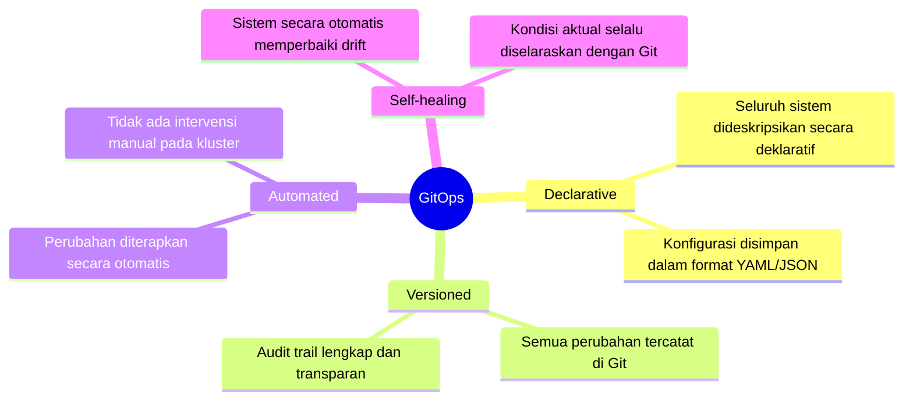
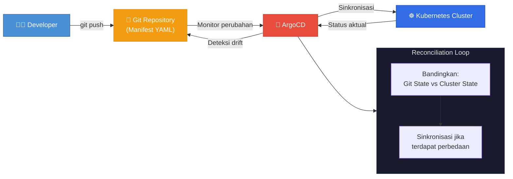
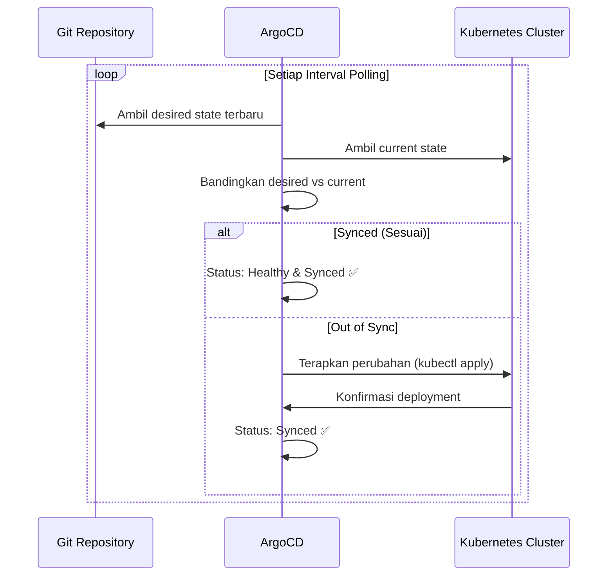

Proses deployment aplikasi ke lingkungan produksi seringkali menjadi tahapan yang penuh risiko. Tanpa mekanisme kontrol yang baik, perbedaan konfigurasi antara lingkungan pengembangan dan produksi dapat menimbulkan masalah yang sulit ditelusuri. **GitOps** hadir sebagai metodologi yang menjadikan Git sebagai satu-satunya sumber kebenaran (*Single Source of Truth*) untuk seluruh konfigurasi infrastruktur dan aplikasi.

Artikel ini membahas konsep GitOps dan implementasinya menggunakan **ArgoCD** pada kluster Kubernetes.

<!--truncate-->

## Apa Itu GitOps?

GitOps adalah paradigma operasional yang menetapkan repositori Git sebagai sumber otoritatif untuk definisi infrastruktur dan konfigurasi aplikasi. Dengan pendekatan ini, seluruh perubahan pada infrastruktur harus dilakukan melalui mekanisme Git (*commit*, *pull request*, *merge*), bukan melalui intervensi manual pada server.

### Prinsip-prinsip GitOps

## ArgoCD: GitOps Controller untuk Kubernetes

ArgoCD adalah *GitOps Continuous Delivery tool* yang secara aktif memonitor repositori Git dan memastikan kondisi kluster Kubernetes selalu selaras dengan definisi yang tersimpan di repositori.

### Alur Kerja ArgoCD

### Mekanisme Kerja ArgoCD

1. **Monitoring Kontinyu** — ArgoCD secara berkala memonitor repositori Git untuk mendeteksi setiap perubahan pada manifest Kubernetes.

2. **Sinkronisasi Otomatis** — Apabila terdeteksi perbedaan antara kondisi yang didefinisikan di Git dengan kondisi aktual di kluster, ArgoCD secara otomatis melakukan sinkronisasi.

3. **Self-healing** — Jika terjadi perubahan manual pada kluster (*configuration drift*), ArgoCD akan mengembalikan kondisi kluster sesuai dengan definisi di Git.

## Siklus Reconciliation

## Keunggulan ArgoCD

| Aspek | Deployment Tradisional | GitOps dengan ArgoCD |
|---|---|---|
| **Sumber Kebenaran** | Server / manual | Git repository |
| **Audit Trail** | Terbatas | Lengkap (Git history) |
| **Rollback** | Manual & berisiko | `git revert` — otomatis & aman |
| **Transparansi** | Rendah | Tinggi (siapa mengubah apa, kapan) |
| **Self-healing** | ❌ | ✅ Otomatis |
| **Multi-cluster** | Kompleks | Didukung secara native |

## Keunggulan Utama

1. **Otomatisasi Penuh** — Cukup melakukan `git push`, dan ArgoCD akan menangani seluruh proses deployment ke kluster Kubernetes.

2. **Rollback yang Aman** — Jika terjadi kesalahan pada deployment, cukup lakukan *revert commit* di Git, dan kluster akan secara otomatis kembali ke versi sebelumnya.

3. **Transparansi dan Akuntabilitas** — Seluruh perubahan tercatat di Git history, sehingga memudahkan proses audit dan *troubleshooting*.

4. **Eliminasi Configuration Drift** — ArgoCD memastikan tidak ada perbedaan antara konfigurasi yang didefinisikan dan yang berjalan di kluster.

## Kesimpulan

Adopsi GitOps dengan ArgoCD merupakan langkah strategis dalam memodernisasi proses deployment dan pengelolaan infrastruktur Kubernetes. Dengan menjadikan Git sebagai satu-satunya sumber kebenaran, tim dapat meningkatkan keandalan, keamanan, dan efisiensi operasional secara signifikan.

:::tip Langkah Selanjutnya
Untuk memulai implementasi ArgoCD, silakan merujuk ke [dokumentasi resmi ArgoCD](https://argo-cd.readthedocs.io/) dan pertimbangkan untuk mengintegrasikannya dengan **Sealed Secrets** untuk pengelolaan *secrets* yang aman.
:::
