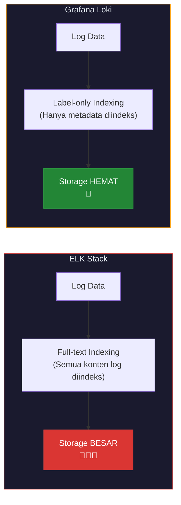
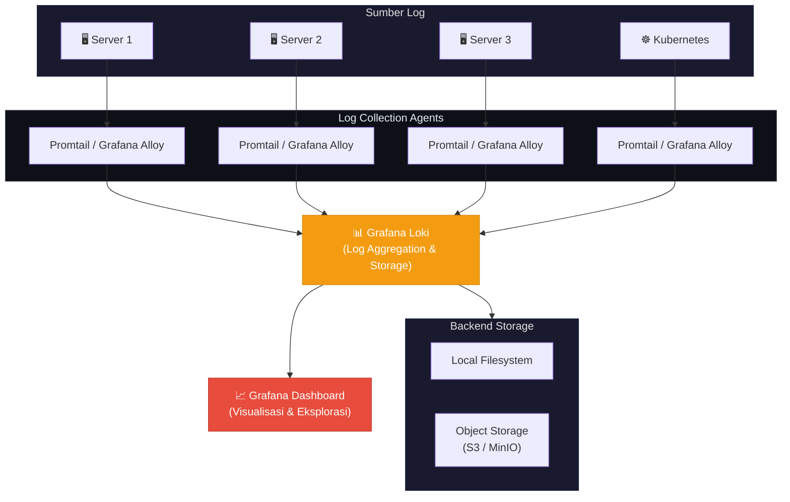
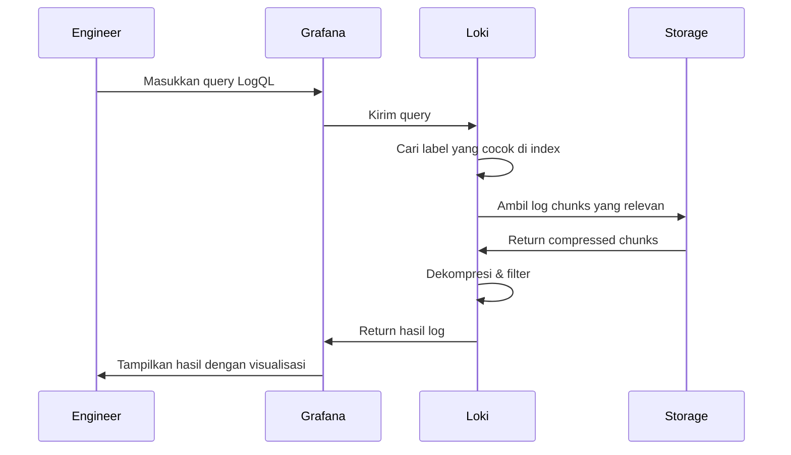

Dalam lingkungan infrastruktur yang terdistribusi, proses penelusuran masalah melalui log menjadi tantangan tersendiri. Mengakses puluhan server secara terpisah hanya untuk mencari satu baris error merupakan pendekatan yang tidak efisien dan memakan waktu. **Centralized logging** hadir sebagai solusi dengan mengagregasi seluruh log ke dalam satu sistem terpusat.

Artikel ini membahas **Grafana Loki** — sebuah sistem log terpusat yang dirancang untuk menjadi ringan, efisien, dan mudah diintegrasikan dengan ekosistem Grafana.

<!--truncate-->

## Mengapa Grafana Loki?

Ketika membahas sistem log terpusat, solusi yang paling umum adalah **ELK Stack** (Elasticsearch, Logstash, Kibana). Meskipun sangat powerful, ELK seringkali membutuhkan resource yang signifikan, khususnya dalam hal konsumsi memori dan storage. Grafana Loki menawarkan pendekatan yang berbeda secara fundamental.

### Perbedaan Pendekatan Loki vs ELK



### Keunggulan Loki

- **Indexing Berbasis Label** — Loki tidak mengindeks seluruh konten log, melainkan hanya label metadata (serupa dengan cara kerja Prometheus). Hal ini menghasilkan penggunaan storage yang jauh lebih efisien.
- **Integrasi Native dengan Grafana** — Sebagai bagian dari ekosistem Grafana, visualisasi dan eksplorasi log di Grafana Dashboard berjalan secara seamless.
- **Konsumsi Resource Minimal** — Cocok untuk infrastruktur dengan keterbatasan resource.

## Arsitektur Sistem



## Cara Kerja

### 1. Pengumpulan Log

Agen ringan bernama **Promtail** atau **Grafana Alloy** diinstal pada setiap server. Agen ini bertugas:
- Membaca file log yang telah dikonfigurasi
- Menambahkan label metadata (nama aplikasi, level log, hostname, dll.)
- Mengirimkan log ke instance Loki

### 2. Penyimpanan dan Indexing

Loki menerima log dan menyimpannya dengan pendekatan unik:
- **Index** hanya menyimpan metadata label
- **Chunk** menyimpan konten log aktual dalam format terkompresi

### 3. Query dan Visualisasi

Loki menggunakan bahasa query bernama **LogQL** yang intuitif dan powerful:

```logql
{app="payment-api", level="error"}
```

Query di atas akan menampilkan seluruh log error dari aplikasi payment-api tanpa perlu mengakses server secara langsung.

## Alur Pencarian Log



## Perbandingan Loki vs ELK Stack

| Aspek | ELK Stack | Grafana Loki |
|---|---|---|
| **Metode Indexing** | Full-text indexing | Label-only indexing |
| **Konsumsi Storage** | Tinggi | Rendah |
| **Konsumsi RAM** | Tinggi | Rendah |
| **Bahasa Query** | KQL / Lucene | LogQL |
| **Integrasi Grafana** | Melalui plugin | Native |
| **Kompleksitas Setup** | Tinggi | Rendah |
| **Cocok Untuk** | Enterprise besar | Tim kecil hingga besar |

## Kesimpulan

Grafana Loki merupakan solusi *centralized logging* yang sangat efisien dan hemat resource. Dengan pendekatan *label-only indexing*, Loki mampu menangani volume log yang besar tanpa memerlukan infrastruktur storage yang masif. Integrasi native dengan Grafana menjadikannya pilihan yang ideal bagi tim yang telah mengadopsi ekosistem Grafana untuk monitoring.

:::tip Rekomendasi
Untuk lingkungan produksi, pertimbangkan penggunaan **Object Storage** (seperti S3 atau MinIO) sebagai backend storage Loki agar mendapatkan durabilitas dan skalabilitas yang lebih baik.
:::
