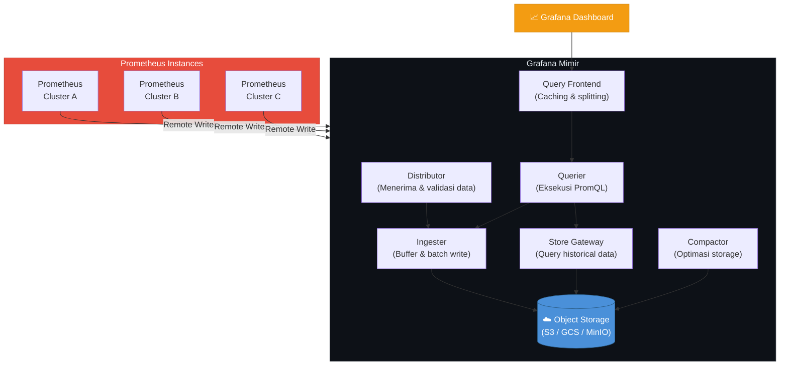
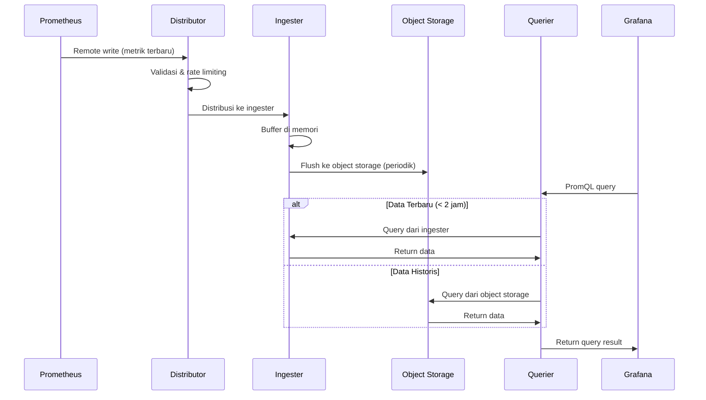
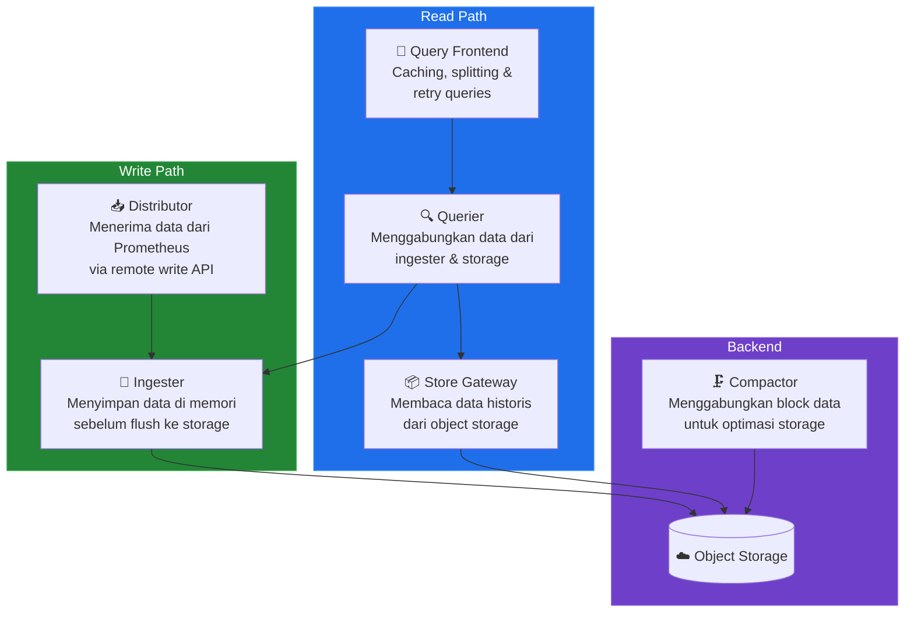

Prometheus merupakan standar de facto untuk pengumpulan dan penyimpanan metrik dalam ekosistem cloud-native. Namun, seiring pertumbuhan infrastruktur, Prometheus menghadapi keterbatasan dalam hal kapasitas penyimpanan jangka panjang dan skalabilitas horizontal. **Grafana Mimir** hadir sebagai solusi *long-term metric storage* yang dirancang untuk mengatasi keterbatasan tersebut.

Artikel ini membahas arsitektur, keunggulan, dan alasan mengapa Mimir merupakan komplemen yang ideal untuk deployment Prometheus berskala besar.

<!--truncate-->

## Apa Itu Grafana Mimir?

Grafana Mimir adalah sistem penyimpanan metrik jangka panjang (*long-term storage*) yang dirancang khusus untuk skalabilitas tinggi dan ketersediaan tinggi (*high availability*). Jika Prometheus berperan sebagai pengumpul dan penyimpan metrik jangka pendek, Mimir berperan sebagai penyimpan metrik jangka panjang yang mampu menampung data dari ratusan hingga ribuan instance Prometheus.

## Arsitektur Grafana Mimir

## Mengapa Mimir Diperlukan?

### Keterbatasan Prometheus

| Aspek | Prometheus | Grafana Mimir |
|---|---|---|
| **Skalabilitas** | Vertikal (single node) | Horizontal (multi-node) |
| **Retensi Data** | Terbatas (minggu/bulan) | Tidak terbatas (tahun) |
| **High Availability** | Memerlukan konfigurasi tambahan | Bawaan (*built-in*) |
| **Multi-tenancy** | ❌ Tidak didukung | ✅ Didukung secara native |
| **Global View** | Terbatas pada satu instance | Agregasi dari seluruh instance |
| **Storage Backend** | Local disk | Object storage (S3/GCS/MinIO) |

### Keunggulan Utama Mimir

1. **Skalabilitas Horizontal** — Mampu menangani jutaan metrik aktif (*active series*) melalui arsitektur microservice yang dapat di-*scale* secara independen per komponen.

2. **High Availability** — Data direplikasi secara otomatis sehingga tidak ada *single point of failure*. Kegagalan pada satu node tidak akan menyebabkan kehilangan data.

3. **Multi-tenancy** — Mendukung pemisahan data antar tim, proyek, atau kluster dalam satu deployment Mimir. Setiap tenant memiliki isolasi data yang ketat.

4. **Performa Query yang Tinggi** — Meskipun data telah tersimpan dalam jangka waktu yang lama, query tetap dapat dieksekusi dengan cepat berkat mekanisme *query splitting*, *caching*, dan *parallel execution*.

## Alur Data

## Komponen Mimir

## Kapan Mengadopsi Mimir?

| Kondisi | Rekomendasi |
|---|---|
| Infrastruktur kecil, satu kluster | Prometheus sudah memadai |
| Butuh retensi data > 3 bulan | ✅ Pertimbangkan Mimir |
| Multi-cluster Kubernetes | ✅ Sangat direkomendasikan |
| Kebutuhan multi-tenancy | ✅ Wajib menggunakan Mimir |
| Metrik aktif > 1 juta series | ✅ Sangat direkomendasikan |

## Kesimpulan

Grafana Mimir merupakan solusi yang tepat bagi organisasi yang membutuhkan penyimpanan metrik berskala besar dengan retensi jangka panjang. Dengan arsitektur microservice yang dapat di-*scale* secara horizontal, dukungan multi-tenancy, dan integrasi seamless dengan ekosistem Grafana, Mimir menjadi komplemen yang ideal untuk deployment Prometheus di lingkungan produksi.

:::tip Rekomendasi
Untuk memulai, Grafana Mimir dapat dijalankan dalam mode **monolithic** yang lebih sederhana untuk infrastruktur kecil, kemudian dimigrasikan ke mode **microservice** seiring dengan pertumbuhan kebutuhan.
:::
