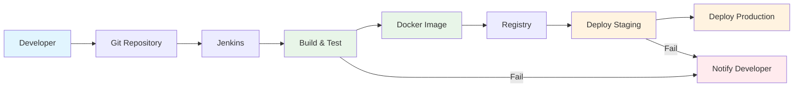

# CI/CD

CI/CD (Continuous Integration/Continuous Deployment) adalah praktik DevOps untuk otomatisasi build, test, dan deployment aplikasi.

## Konsep Dasar CI/CD

### Continuous Integration (CI)
- **Definisi**: Praktik menggabungkan kode dari multiple developer ke repository bersama secara otomatis
- **Tujuan**: Deteksi bug lebih awal, mengurangi konflik merge, memastikan kualitas kode
- **Proses**: Build otomatis, testing otomatis, code analysis

### Continuous Deployment (CD)
- **Definisi**: Otomatisasi deployment aplikasi ke production setelah semua test berhasil
- **Tujuan**: Release lebih cepat, mengurangi human error, feedback loop yang lebih pendek
- **Proses**: Deployment otomatis, rollback otomatis, monitoring

## Alur CI/CD: Developer → Bitbucket → Jenkins

### 1. Developer Commit
```bash
# Developer melakukan perubahan kode
git add .
git commit -m "feat: add new user authentication feature"
git push origin feature/user-auth
```

### 2. Bitbucket Webhook
- Bitbucket mendeteksi push ke repository
- Webhook dikirim ke Jenkins server
- Jenkins menerima payload dengan informasi commit

### 3. Jenkins Pipeline
```groovy
pipeline {
    agent any
    
    stages {
        stage('Checkout') {
            steps {
                checkout scm
            }
        }
        
        stage('Build') {
            steps {
                sh 'mvn clean compile'
            }
        }
        
        stage('Test') {
            steps {
                sh 'mvn test'
            }
        }
        
        stage('SonarQube Analysis') {
            steps {
                withSonarQubeEnv('SonarQube') {
                    sh 'mvn sonar:sonar'
                }
            }
        }
        
        stage('Build Docker Image') {
            steps {
                sh 'docker build -t myapp:$BUILD_NUMBER .'
            }
        }
        
        stage('Push to Registry') {
            steps {
                sh 'docker push myapp:$BUILD_NUMBER'
            }
        }
        
        stage('Deploy to Staging') {
            steps {
                sh 'kubectl set image deployment/myapp myapp=myapp:$BUILD_NUMBER'
            }
        }
        
        stage('Integration Tests') {
            steps {
                sh 'mvn verify'
            }
        }
        
        stage('Deploy to Production') {
            when {
                branch 'main'
            }
            steps {
                sh 'kubectl set image deployment/myapp-prod myapp=myapp:$BUILD_NUMBER'
            }
        }
    }
    
    post {
        always {
            cleanWs()
        }
        success {
            echo 'Pipeline berhasil!'
        }
        failure {
            echo 'Pipeline gagal!'
        }
    }
}
```

## Diagram Alur CI/CD



## Komponen Penting

### 1. Version Control System (Bitbucket)
- **Repository**: Tempat menyimpan kode sumber
- **Branch Strategy**: Git Flow, GitHub Flow, atau trunk-based development
- **Webhook**: Trigger otomatis ke Jenkins saat ada perubahan

### 2. CI/CD Server (Jenkins)
- **Pipeline**: Definisi alur CI/CD dalam bentuk code
- **Plugins**: Integrasi dengan tools lain
- **Build Agents**: Worker untuk menjalankan pipeline

### 3. Build Tools
- **Maven/Gradle**: Untuk aplikasi Java
- **npm/yarn**: Untuk aplikasi Node.js
- **Docker**: Containerization

### 4. Testing
- **Unit Tests**: Testing komponen individual
- **Integration Tests**: Testing integrasi antar komponen
- **E2E Tests**: Testing end-to-end

### 5. Code Quality
- **SonarQube**: Static code analysis
- **Code Coverage**: Persentase kode yang ditest
- **Security Scanning**: Deteksi vulnerability

### 6. Container Registry
- **Docker Hub**: Registry publik
- **Private Registry**: Registry internal perusahaan
- **Image Tagging**: Versioning untuk deployment

### 7. Deployment
- **Kubernetes**: Container orchestration
- **Helm Charts**: Package manager untuk Kubernetes
- **Rollback Strategy**: Strategi rollback jika deployment gagal

## Best Practices

### 1. Pipeline as Code
- Simpan pipeline dalam repository
- Version control untuk pipeline
- Review pipeline seperti review kode

### 2. Security
- Scan dependency untuk vulnerability
- Rotate credentials secara berkala
- Implement least privilege principle

### 3. Monitoring
- Monitor pipeline execution time
- Alert jika pipeline gagal
- Metrics untuk improvement

### 4. Testing Strategy
- Automated testing di setiap stage
- Parallel testing untuk speed up
- Test data management

## Tools Populer

### CI/CD Platforms
- **Jenkins**: Open-source, highly customizable
- **GitLab CI**: Integrated dengan GitLab
- **GitHub Actions**: Integrated dengan GitHub
- **Azure DevOps**: Microsoft's solution
- **CircleCI**: Cloud-based CI/CD

### Container & Orchestration
- **Docker**: Container platform
- **Kubernetes**: Container orchestration
- **Helm**: Package manager for Kubernetes

### Monitoring & Logging
- **Prometheus**: Metrics collection
- **Grafana**: Visualization
- **ELK Stack**: Log management

## Topik
- Pengertian CI/CD
- Tools populer: Jenkins, GitLab CI, GitHub Actions
- Pipeline dasar 