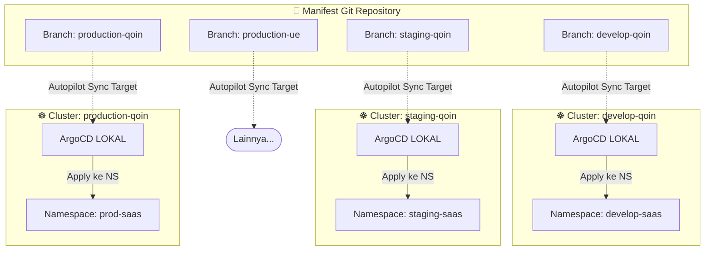

# ArgoCD Autopilot — Multi-Cluster via Branch Isolation

[ArgoCD Autopilot](https://argocd-autopilot.readthedocs.io/) adalah CLI tool resmi dari Argo Project yang memberikan opini dan struktur terbaik (*best-practice*) untuk mengatur GitOps repository, installasi ArgoCD, dan manajemen lifecycle aplikasi secara otomatis. 

Namun, tutorial bawaan `argocd-autopilot` sering berfokus pada pendekatan *Multi-Folder* (satu branch utama dengan struktur folder `/kustomize/overlays/prod` dsb) menggunakan satu ArgoCD terpusat (*Hub & Spoke*). 

Sesuai dengan kebutuhan arsitektur tingkat lanjut untuk tata kelola yang rapi dan terisolasi, kita menggunakan konsep **Branch-Based Multi-Cluster** di mana:
1. **Satu Git Repository**, namun konfigurasi cluster dipisahkan **ke dalam Branch yang berbeda** berdasarkan nama cluster/environment (contoh: branch `develop-qoin`, `staging-qoin`, `production-qoin`, `production-ue`).
2. **Semua manifest aplikasi untuk satu environment dikumpulkan dalam 1 namespace utama** (contoh: namespace `develop-saas`).
3. **ArgoCD di-install lokal di masing-masing cluster**, sehingga tidak ada *Single Point of Failure* antar environment.

---

## 🏛️ Arsitektur Autopilot Multi-Branch

Setiap cluster memiliki entitas ArgoCD sendiri yang dipasang (*bootstrap*) oleh `argocd-autopilot`. Masing-masing ArgoCD hanya membaca (pull) dari *branch* yang dikhususkan untuk cluster tersebut, dan menargetkan deployment ke namespace spesifik.



---

## 🚀 Instalasi & Persiapan

### 1. Download `argocd-autopilot` CLI

```bash
# Mac (Homebrew)
brew tap argoproj/tap
brew install argoproj/tap/argocd-autopilot

# Linux (Binary)
curl -L --output - https://github.com/argoproj-labs/argocd-autopilot/releases/latest/download/argocd-autopilot-linux-amd64.tar.gz | tar zx
sudo mv ./argocd-autopilot /usr/local/bin/
```

### 2. Set Env Variables Git

`argocd-autopilot` membutuhkan akses penuh untuk membaca dan merapikan struktur repo. Simpan variabel berikut seseuai akun Git.

```bash
export GIT_TOKEN="ghp_xxxxxxxxxxxxxxxxxxxxxx"
export GIT_REPO="https://github.com/my-org/gitops-apps"
```

---

## 🛠️ Bootstrapping Cluster dengan CLI 

Proses *bootstrap* akan otomatis menginstal ArgoCD, membuat folder struktur tata letak aplikasi `bootstrap/`, merekatkan `Root Application`, dan melakukan struktur inisiasi awal ke repo pada *branch* target.

### ⚙️ Cluster 1: Develop Qoin (Branch `develop-qoin`)

Pertama, arahkan `kubectl` ke cluster dev, kemudian jalankan bootstrap:

```bash
# Set konteks ke cluster develop-qoin
kubectl config use-context cluster-develop-qoin

# Bootstrap ArgoCD menunjuk branch 'develop-qoin'
argocd-autopilot repo bootstrap \
  --repo $GIT_REPO \
  --branch develop-qoin \
  --installation-mode normal
```

### ⚙️ Cluster 2: Staging Qoin (Branch `staging-qoin`)

```bash
kubectl config use-context cluster-staging-qoin

argocd-autopilot repo bootstrap \
  --repo $GIT_REPO \
  --branch staging-qoin \
  --installation-mode normal
```

Lakukan hal yang sama untuk branch `production-qoin` dan `production-ue`.

---

## 📦 Mengelola Project & Aplikasi

Setelah ArgoCD terinstall lokal, mari deploy manifest aplikasi (contoh API Gateway) ke dalam single namespace (contoh: `develop-saas`).

### 1. Buat Project & Destinasi Namespace

```bash
# Buat project 'saas-apps' di cluster develop-qoin yang dipetakan ke namespace 'develop-saas'
argocd-autopilot project create saas-apps \
  --repo $GIT_REPO \
  --branch develop-qoin \
  --dest-namespace develop-saas
```

### 2. Tambahkan Aplikasi ke Namespace Tersebut

```bash
argocd-autopilot app create api-gateway \
  --app github.com/my-org/app-manifests/api-gateway/kustomize \
  -p saas-apps \
  --repo $GIT_REPO \
  --branch develop-qoin \
  --dest-namespace develop-saas
```

### Menyimpan Struktur di Git

Perintah tadi akan menuliskan root folder khusus pada cabang / *branch* target Anda secara otomatis (misal pada branch `develop-qoin`):
```text
(branch develop-qoin)
.
├── bootstrap
│   └── (ArgoCD app list & cluster settings)
└── projects
    └── saas-apps
        ├── saas-apps.yaml (Memuat argocd AppProject -> dest namespace: develop-saas)
        └── api-gateway
            └── api-gateway.yaml (Target sync aplikasi)
```

---

## 🔄 Migrasi ArgoCD Existing (Tanpa Downtime)

Jika saat ini Anda di cluster sudah memasang ArgoCD biasa (manual apply manifest), dan ingin berpindah mengadopsi CLI Autopilot tanpa mengorbankan aplikasi yang sedang berjalan, ini langkah amannya:

### Kondisi Awal:
- Ada deployment manual yang sedang dipantau ArgoCD lama.
- Namespace aplikasi (misal `develop-saas`) sudah dihuni banyak *pod* live.

### Langkah-Langkah Migrasi Zero Downtime:

1. **Nonaktifkan Auto-Sync / Prune di App Lama**
   Di antarmuka *UI ArgoCD existing*, buang/disable fitur *Auto-Sync* dan centang peringatan *Prune*. Ini memastikan ArgoCD lama tidak akan sengaja men-delete resource bila terdeteksi putus dari Git.

2. **Jalankan Bootstrap Autopilot secara Overwrite**
   Anda tidak perlu meng-uninstall namespace `argocd` lama! Jalankan saja perintah bootstrap Autopilot di konteks kubectl tersebut:
   
   ```bash
   argocd-autopilot repo bootstrap \
     --repo $GIT_REPO \
     --branch develop-qoin \
     --installation-mode normal
   ```
   *Autopilot akan melakukan apply / patch pembaruan RBAC, CM, & Deployment pada ArgoCD di namespace yang sama tanpa menghapus trafik.*

3. **Adopsi Resource (Mencegah Out-of-Sync / Recreation)**
   Tambahkan anotasi tracking khusus ke resources Anda yang sebelumnya dibuat non-autopilot agar Autopilot merasa **"Ya, ini aplikasi yang berada di bawah perlindungan namespace ini"** (Bypass Tracking Label Migration).

   Untuk aplikasi yang ingin migrasi ke struktur project `saas-apps` Autopilot, atur di CLI config-nya nanti:
   ```bash
   argocd-autopilot app create api-gateway \
     ...
     --labels argocd.argoproj.io/instance=api-gateway
   ```
   *Bila status aplikasi saat pertama kali di-sync oleh Autopilot memunculkan "Out-of-Sync", Anda tidak usah panik. Lakukan klik "Sync" dengan centang `Replace=true` (bila diperlukan).*  

4. **Hapus Entry App Lama dari Root Argo**
   Bila App dari Autopilot (misal AppName: `saas-apps-api-gateway`) sukses muncul dengan status hijau/Healthy layaknya App manual awal, di terminal atau UI ArgoCD lama, anda boleh men-Delete item "App versi manual" dengan metode **Non-Cascading Delete** (Hati-Hati, *hanya delete entri metadata Argocd, jangan resource k8s-nya!*).

---

## 🔀 Promosi Rilis Lewat PR

Branching model per environment membuat persetujuan (approval) lebih kuat.

1. Pipeline di CI push update image tag ke Git `develop-qoin`.
2. Saat sprint selesai dan akan masuk Staging, Lead Engineer membuka **PULL REQUEST** dari branch `develop-qoin` merjer ke branch `staging-qoin` (atau cherry-pick komit folder manifest tertentu agar aman).
3. ArgoCD Autopilot di Staging-Qoin akan sinkron dengan otomatis begitu branch merge disetujui. 
4. Demikian sama halnya untuk PR rilis menuju cabang `production-qoin` & `production-ue`.
