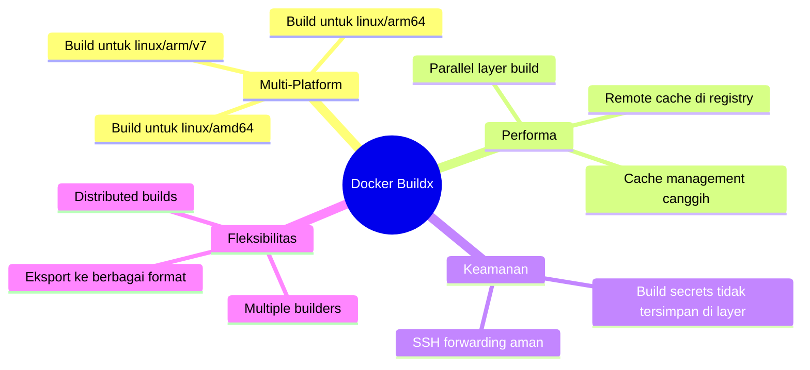
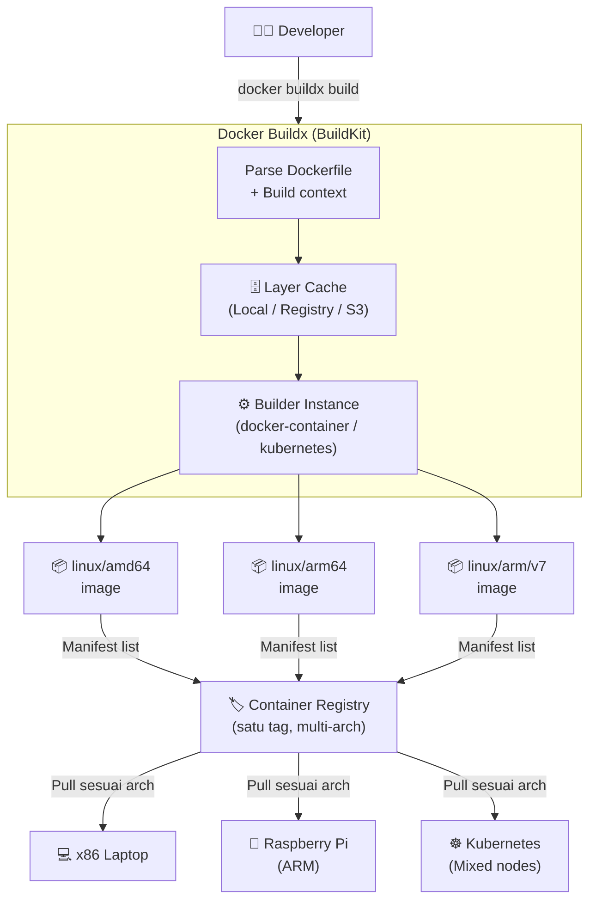
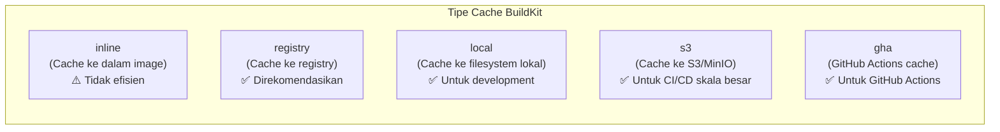

# Docker Buildx — Multi-Platform Image Build

Docker Buildx adalah ekstensi resmi Docker yang menggunakan **BuildKit** sebagai backend build engine. Buildx mendukung pembangunan image untuk berbagai platform (multi-arch), build terdistribusi, dan fitur-fitur BuildKit canggih seperti cache mounting dan build secrets.

---

## Mengapa Buildx?



---

## Alur Build Multi-Platform



---

## Setup Builder

```bash
# Buat builder instance baru menggunakan docker-container driver
# (mendukung multi-platform, tidak seperti builder 'default')
docker buildx create \
  --name multiarch-builder \
  --driver docker-container \
  --driver-opt network=host \
  --use

# Bootstrap builder (download image BuildKit)
docker buildx inspect --bootstrap

# Cek platform yang didukung
docker buildx inspect multiarch-builder

# Daftar semua builder
docker buildx ls
```

---

## Build Multi-Platform Image

### Build dan Push Langsung ke Registry

```bash
# Build untuk amd64 + arm64, langsung push ke registry
docker buildx build \
  --platform linux/amd64,linux/arm64 \
  --tag registry.example.com/myapp:v1.2.3 \
  --tag registry.example.com/myapp:latest \
  --push \
  .
```

### Build dengan Cache dari Registry

```bash
docker buildx build \
  --platform linux/amd64,linux/arm64 \
  --tag registry.example.com/myapp:${GIT_SHA} \
  --cache-from type=registry,ref=registry.example.com/myapp:cache \
  --cache-to   type=registry,ref=registry.example.com/myapp:cache,mode=max \
  --push \
  .
```

---

## Dockerfile Optimasi untuk BuildKit

```dockerfile
# syntax=docker/dockerfile:1.6
FROM node:20-alpine AS deps
WORKDIR /app
# Mount cache npm agar tidak re-download setiap build
RUN --mount=type=cache,target=/root/.npm \
    --mount=type=bind,source=package.json,target=package.json \
    --mount=type=bind,source=package-lock.json,target=package-lock.json \
    npm ci --only=production

FROM node:20-alpine AS builder
WORKDIR /app
COPY --from=deps /app/node_modules ./node_modules
COPY . .
RUN npm run build

FROM node:20-alpine AS runner
WORKDIR /app
ENV NODE_ENV=production

# Copy hanya artefak yang diperlukan
COPY --from=builder /app/dist ./dist
COPY --from=deps /app/node_modules ./node_modules

# Jalankan sebagai non-root user
RUN addgroup --system --gid 1001 nodejs && \
    adduser  --system --uid 1001 nextjs
USER nextjs

EXPOSE 3000
CMD ["node", "dist/server.js"]
```

---

## Integrasi di Jenkins Pipeline

```groovy
pipeline {
    agent any

    environment {
        REGISTRY = 'registry.example.com'
        IMAGE    = 'myapp'
        TAG      = "${GIT_COMMIT[0..7]}"
    }

    stages {
        stage('Setup Buildx') {
            steps {
                sh '''
                    # Pastikan builder multi-platform tersedia
                    docker buildx inspect multiarch-builder || \
                    docker buildx create \
                        --name multiarch-builder \
                        --driver docker-container \
                        --use

                    docker buildx inspect --bootstrap
                '''
            }
        }

        stage('Build & Push Multi-Arch') {
            steps {
                withCredentials([usernamePassword(
                    credentialsId: 'registry-creds',
                    usernameVariable: 'REG_USER',
                    passwordVariable: 'REG_PASS'
                )]) {
                    sh '''
                        echo $REG_PASS | docker login $REGISTRY \
                            -u $REG_USER --password-stdin

                        docker buildx build \
                            --platform linux/amd64,linux/arm64 \
                            --tag $REGISTRY/$IMAGE:$TAG \
                            --tag $REGISTRY/$IMAGE:latest \
                            --cache-from type=registry,ref=$REGISTRY/$IMAGE:cache \
                            --cache-to   type=registry,ref=$REGISTRY/$IMAGE:cache,mode=max \
                            --push \
                            .
                    '''
                }
            }
        }
    }
}
```

---

## Strategi Cache



| Tipe Cache | Kapan Digunakan | Keunggulan |
|---|---|---|
| `registry` | CI/CD dengan registry privat | Bisa dipakai antar runner berbeda |
| `local` | Development lokal | Paling cepat — tidak perlu network |
| `s3` | CI/CD skala enterprise | Bisa share antar tim/region |
| `gha` | GitHub Actions | Terintegrasi native dengan GHA |

---

## Perbandingan: Docker Build vs Buildx

| Fitur | `docker build` | `docker buildx build` |
|---|---|---|
| Multi-platform | ❌ | ✅ |
| Cache mounting | ❌ | ✅ |
| Remote cache | ❌ | ✅ |
| Build secrets | ❌ | ✅ |
| Parallel stages | ❌ | ✅ |
| Output format | Image saja | Image, tarball, lokal, OCI |

---

## Best Practices

- Selalu gunakan `.dockerignore` untuk mengecualikan `node_modules`, `.git`, dan file tidak diperlukan dari build context
- Urutkan instruksi Dockerfile dari **paling jarang berubah** (dependencies) ke **paling sering berubah** (source code) untuk memaksimalkan layer cache
- Gunakan **multi-stage build** untuk menghasilkan image produksi yang minimal
- Gunakan `--mount=type=cache` untuk direktori yang sering di-download (npm, pip, go modules)
- Jalankan container sebagai **non-root user** untuk keamanan
