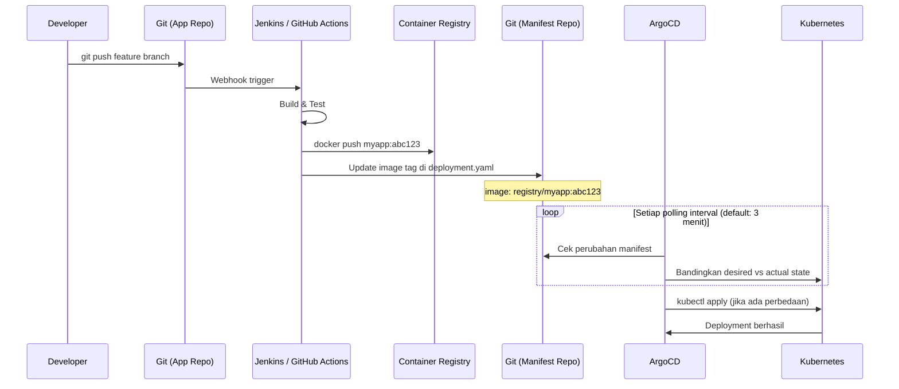
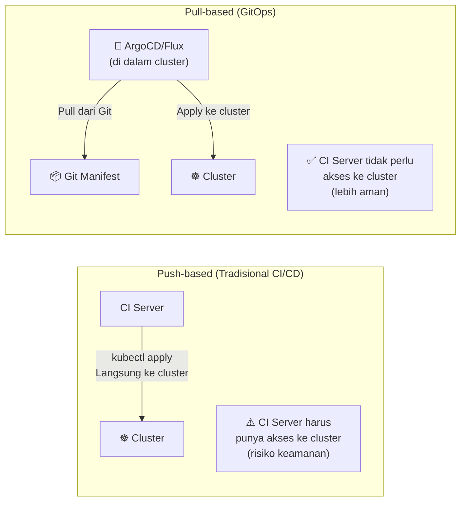

# GitOps dalam CI/CD Pipeline

GitOps adalah praktik operasional yang menjadikan **Git sebagai satu-satunya sumber kebenaran** untuk konfigurasi infrastruktur dan deployment aplikasi. GitOps melengkapi pipeline CI/CD dengan memisahkan proses *build* (CI) dari proses *delivery* (CD).

---

## CI vs CD di GitOps

```mermaid
flowchart LR
    subgraph CI["🔄 Continuous Integration"]
        direction TB
        Code["Source Code"] --> Build["Build & Test"]
        Build --> Image["Docker Image"]
        Image --> Registry["Container Registry"]
        Registry --> UpdateManifest["Update image tag\ndi Git Manifest repo"]
    end

    subgraph CD["🚀 Continuous Delivery (GitOps)"]
        direction TB
        ManifestRepo["📦 Git Manifest Repo\n(Kubernetes YAML/Helm)"]
        ArgoCD["🐙 ArgoCD / Flux\n(Pull-based CD operator)"]
        K8s["☸️ Kubernetes Cluster"]
        ManifestRepo -->|"Watch perubahan"| ArgoCD
        ArgoCD -->|"Sinkronisasi otomatis"| K8s
    end

    UpdateManifest -->|"Trigger via PR/commit"| ManifestRepo
```



---

## GitOps dengan ArgoCD — Alur Lengkap



---

## Repository Structure

Pisahkan **App Repository** (source code) dan **Manifest Repository** (Kubernetes config):

```
📦 app-repo/              ← Source code
   ├── src/
   ├── Dockerfile
   └── Jenkinsfile         ← CI pipeline

📦 manifest-repo/         ← GitOps configs
   ├── apps/
   │   ├── staging/
   │   │   └── myapp/
   │   │       ├── deployment.yaml
   │   │       └── service.yaml
   │   └── production/
   │       └── myapp/
   │           ├── deployment.yaml
   │           └── service.yaml
   └── argocd/
       ├── app-staging.yaml
       └── app-production.yaml
```

---

## Contoh ArgoCD Application Manifest

```yaml
# argocd/app-production.yaml
apiVersion: argoproj.io/v1alpha1
kind: Application
metadata:
  name: myapp-production
  namespace: argocd
spec:
  project: default
  source:
    repoURL: https://github.com/org/manifest-repo.git
    targetRevision: main
    path: apps/production/myapp
  destination:
    server: https://kubernetes.default.svc
    namespace: production
  syncPolicy:
    automated:
      prune: true      # Hapus resource yang tidak ada di Git
      selfHeal: true   # Kembalikan perubahan manual di cluster
    syncOptions:
      - CreateNamespace=true
```

---

## Update Image Tag Otomatis dari CI

Script yang dijalankan di Jenkins setelah push image:

```bash
#!/bin/bash
# update-manifest.sh

IMAGE_TAG=$1
MANIFEST_REPO="https://github.com/org/manifest-repo.git"
ENVIRONMENT="staging"  # atau production

# Clone manifest repo
git clone $MANIFEST_REPO /tmp/manifest-repo
cd /tmp/manifest-repo

# Update image tag menggunakan sed atau kustomize
sed -i "s|image: registry.example.com/myapp:.*|image: registry.example.com/myapp:${IMAGE_TAG}|g" \
  apps/${ENVIRONMENT}/myapp/deployment.yaml

# Commit dan push
git config user.email "ci-bot@example.com"
git config user.name "CI Bot"
git add .
git commit -m "ci: update myapp image to ${IMAGE_TAG} [skip ci]"
git push origin main
```

---

## Perbandingan: Push vs Pull Deployment



| Aspek | Push-based | Pull-based (GitOps) |
|---|---|---|
| Akses CI ke cluster | ⚠️ Diperlukan | ✅ Tidak diperlukan |
| Audit trail | Terbatas | ✅ Lengkap di Git |
| Rollback | Manual | ✅ `git revert` |
| Drift detection | ❌ | ✅ Otomatis |
| Self-healing | ❌ | ✅ Otomatis |

---

## Tools GitOps

| Tools | Keunggulan |
|---|---|
| **ArgoCD** | UI yang informatif, multi-cluster, banyak digunakan |
| **Flux CD** | Native Kubernetes controller, lebih ringan |
| **Rancher Fleet** | GitOps bawaan Rancher untuk multi-cluster |

> Untuk panduan lengkap ArgoCD, lihat [GitOps dengan ArgoCD](/docs/gitops).
