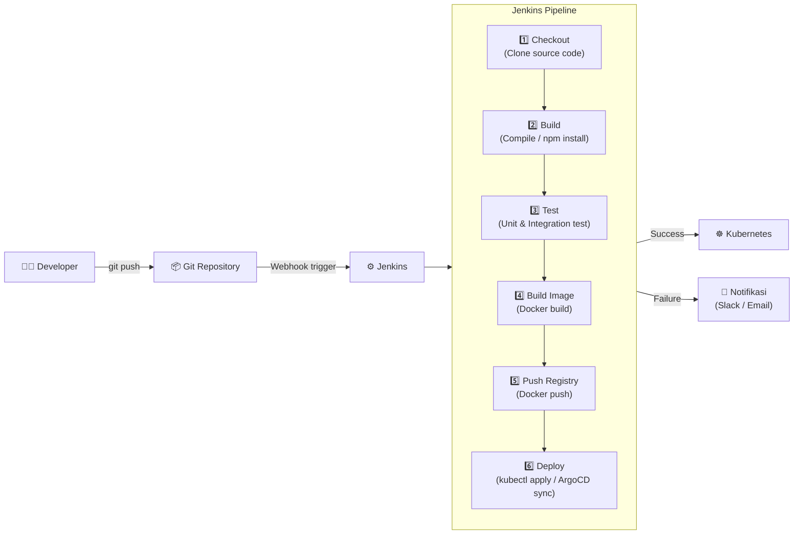
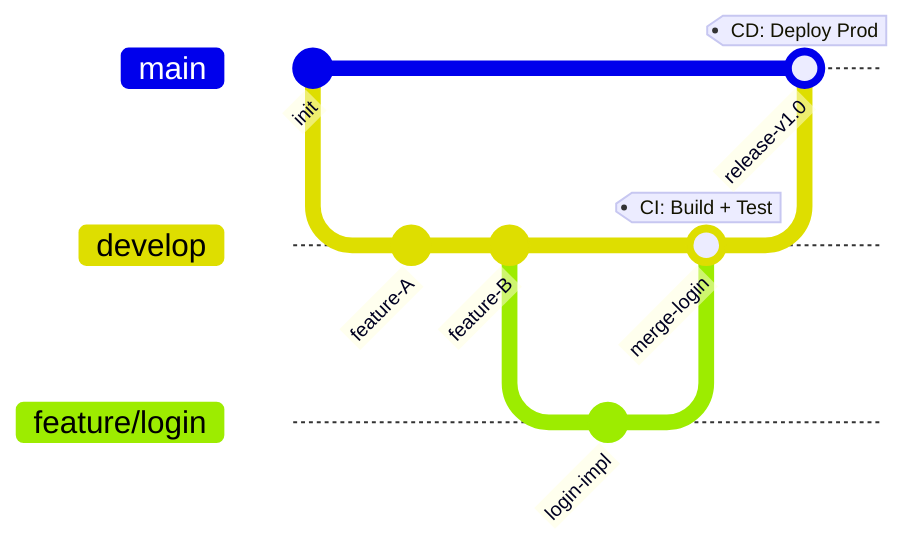
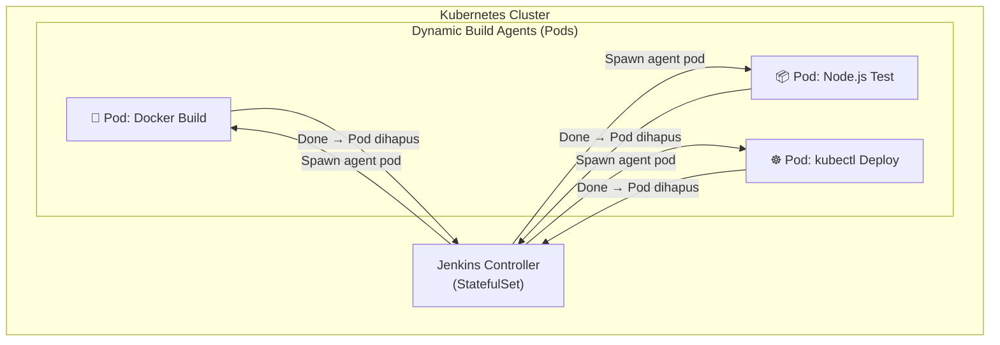

# Jenkins CI/CD

Jenkins adalah server otomatisasi open-source yang paling banyak digunakan untuk membangun pipeline CI/CD (*Continuous Integration / Continuous Deployment*). Jenkins memungkinkan otomatisasi seluruh siklus pengembangan — dari *build*, *test*, hingga *deployment*.

---

## Konsep Dasar



---

## Struktur Jenkinsfile

Jenkinsfile adalah file deklaratif yang mendefinisikan seluruh pipeline sebagai kode (*Pipeline as Code*):

```groovy
pipeline {
    agent {
        kubernetes {
            yaml '''
            apiVersion: v1
            kind: Pod
            spec:
              containers:
              - name: docker
                image: docker:24-dind
                securityContext:
                  privileged: true
              - name: kubectl
                image: bitnami/kubectl:latest
                command: [cat]
                tty: true
            '''
        }
    }

    environment {
        REGISTRY       = 'registry.example.com'
        IMAGE_NAME     = 'myapp'
        IMAGE_TAG      = "${GIT_COMMIT[0..7]}"
        KUBECONFIG     = credentials('kubeconfig-production')
        REGISTRY_CREDS = credentials('registry-credentials')
    }

    stages {
        stage('Checkout') {
            steps {
                checkout scm
                sh 'echo "Branch: ${GIT_BRANCH}, Commit: ${GIT_COMMIT}"'
            }
        }

        stage('Test') {
            steps {
                sh '''
                    npm install
                    npm run test -- --coverage
                '''
            }
            post {
                always {
                    junit 'coverage/test-results.xml'
                    publishHTML(target: [
                        reportDir: 'coverage/lcov-report',
                        reportFiles: 'index.html',
                        reportName: 'Coverage Report'
                    ])
                }
            }
        }

        stage('Build & Push Image') {
            steps {
                container('docker') {
                    sh '''
                        echo $REGISTRY_CREDS_PSW | docker login $REGISTRY \
                            -u $REGISTRY_CREDS_USR --password-stdin

                        docker build \
                            --build-arg BUILD_DATE=$(date -u +'%Y-%m-%dT%H:%M:%SZ') \
                            --build-arg GIT_COMMIT=$GIT_COMMIT \
                            -t $REGISTRY/$IMAGE_NAME:$IMAGE_TAG \
                            -t $REGISTRY/$IMAGE_NAME:latest \
                            .

                        docker push $REGISTRY/$IMAGE_NAME:$IMAGE_TAG
                        docker push $REGISTRY/$IMAGE_NAME:latest
                    '''
                }
            }
        }

        stage('Deploy to Staging') {
            when {
                branch 'develop'
            }
            steps {
                container('kubectl') {
                    sh '''
                        sed -i "s|IMAGE_TAG|$IMAGE_TAG|g" k8s/staging/deployment.yaml
                        kubectl apply -f k8s/staging/ --namespace=staging
                        kubectl rollout status deployment/myapp -n staging --timeout=5m
                    '''
                }
            }
        }

        stage('Deploy to Production') {
            when {
                branch 'main'
            }
            input {
                message "Deploy ke Production?"
                ok "Ya, Deploy!"
                submitter "admin,devops-team"
            }
            steps {
                container('kubectl') {
                    sh '''
                        sed -i "s|IMAGE_TAG|$IMAGE_TAG|g" k8s/production/deployment.yaml
                        kubectl apply -f k8s/production/ --namespace=production
                        kubectl rollout status deployment/myapp -n production --timeout=10m
                    '''
                }
            }
        }
    }

    post {
        success {
            slackSend(
                channel: '#deployments',
                color: 'good',
                message: "✅ *${JOB_NAME}* - Build #${BUILD_NUMBER} berhasil!\nImage: `${REGISTRY}/${IMAGE_NAME}:${IMAGE_TAG}`"
            )
        }
        failure {
            slackSend(
                channel: '#deployments',
                color: 'danger',
                message: "❌ *${JOB_NAME}* - Build #${BUILD_NUMBER} GAGAL!\nLihat log: ${BUILD_URL}"
            )
        }
    }
}
```

---

## Strategi Branching



| Branch | Trigger | Target Deploy |
|---|---|---|
| `feature/*` | PR ke develop | — (hanya test) |
| `develop` | Push / merge | Staging environment |
| `main` | Merge dari develop | Production (dengan approval) |

---

## Jenkins dengan Kubernetes (Jenkins on K8s)

Jenkins dapat berjalan di Kubernetes menggunakan **Jenkins Kubernetes Plugin**, sehingga setiap build berjalan di dalam Pod yang di-*spin up* secara dinamis dan dihancurkan setelah build selesai.



---

## Instalasi dengan Helm

```bash
# Tambahkan Helm repo Jenkins
helm repo add jenkins https://charts.jenkins.io
helm repo update

# Install Jenkins di Kubernetes
helm install jenkins jenkins/jenkins \
  --namespace jenkins \
  --create-namespace \
  --set controller.serviceType=ClusterIP \
  --set persistence.size=20Gi

# Ambil password admin awal
kubectl exec -n jenkins -it svc/jenkins \
  -- /bin/cat /run/secrets/additional/chart-admin-password
```

---

## Best Practices

- **Pipeline as Code** — Selalu simpan Jenkinsfile di repository, bukan dikonfigurasi melalui UI
- **Credential Management** — Gunakan Jenkins Credentials Store, jangan hardcode secret di Jenkinsfile
- **Agent Pod per Job** — Gunakan Kubernetes plugin agar setiap build terisolasi dalam Pod tersendiri
- **Timeout** — Selalu set timeout pada setiap stage untuk mencegah pipeline menggantung
- **Approval Gate** — Tambahkan `input` step sebelum deploy ke production untuk mencegah deploy tidak sengaja
