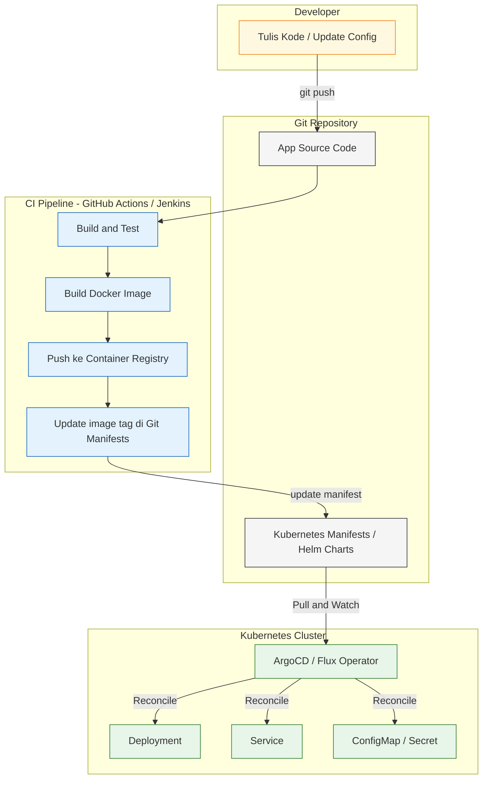
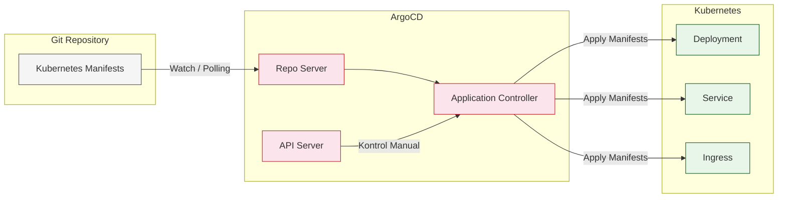
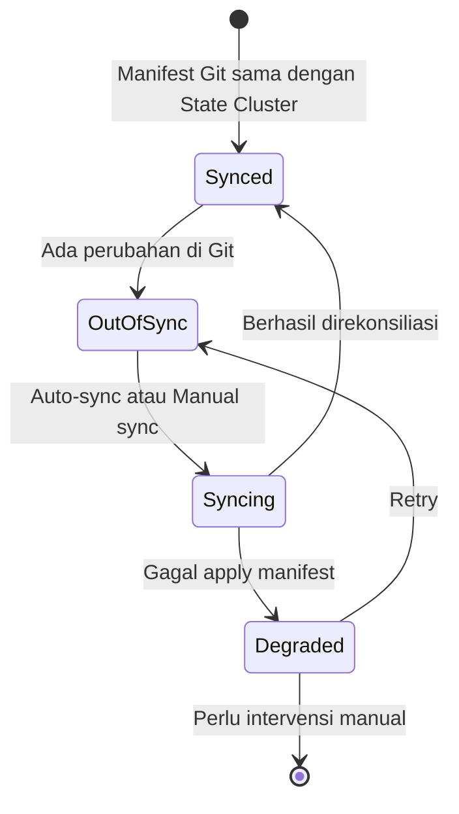

# GitOps

GitOps adalah pendekatan DevOps yang menggunakan Git sebagai sumber kebenaran (*single source of truth*) untuk deployment dan operasi infrastruktur.

## Konsep Dasar GitOps

Prinsip utama GitOps:
- **Deklaratif**: Seluruh state sistem didefinisikan secara deklaratif (YAML/Helm Chart).
- **Versioned**: State tersimpan di Git, sehingga setiap perubahan tercatat dan bisa di-rollback.
- **Automatik**: Perubahan di Git secara otomatis direkonsiliasi ke cluster oleh operator seperti ArgoCD.
- **Continuous Reconciliation**: Operator terus-menerus memastikan state aktual sesuai dengan state yang diinginkan di Git.

---

## Diagram Alur GitOps (Push vs Pull)

Berbeda dengan CI/CD tradisional yang **mendorong (push)** artifact ke cluster, GitOps menggunakan model **tarik (pull)** di mana operator di dalam cluster lah yang mengambil perubahan dari Git.

---

## Diagram Cara Kerja ArgoCD

ArgoCD adalah salah satu tools GitOps paling populer. Ia berjalan **di dalam cluster** dan secara aktif membandingkan state Git vs state aktual cluster.

---

## Status Sinkronisasi ArgoCD

ArgoCD memiliki dua kondisi yang terus dipantau:

---

## Tools GitOps Populer

| Tools | Keterangan |
|---|---|
| **ArgoCD** | GitOps operator berbasis UI, sangat populer untuk Kubernetes |
| **Flux CD** | GitOps toolkit berbasis CLI, native controller |
| **Rancher Fleet** | GitOps untuk multi-cluster bawaan Rancher |
| **Jenkins X** | CI/CD dan GitOps khusus untuk cloud-native apps |