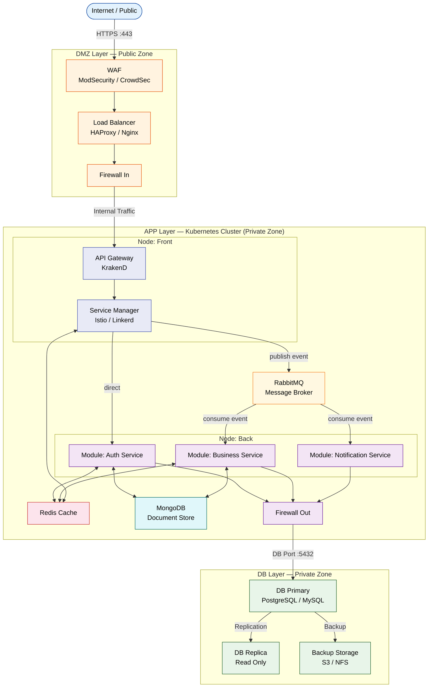
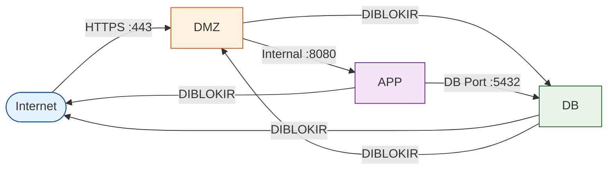

# Infrastructure

Dokumentasi topologi infrastruktur yang mencakup arsitektur 3 layer: **DMZ** (public), **APP** (private — Kubernetes Cluster), dan **DB** (private).

---

## Topologi Jaringan 3 Layer

Arsitektur ini memisahkan infrastruktur menjadi tiga zona keamanan. Hanya layer **DMZ** yang dapat diakses dari internet publik. Layer **APP** adalah sebuah **Kubernetes Cluster** dengan 2 node (front & back), sementara layer **DB** adalah zona paling terlindungi.

---

## Penjelasan Setiap Layer

### 🟠 DMZ Layer (Public Zone)
Layer ini adalah satu-satunya zona yang dapat diakses langsung dari internet. Berfungsi sebagai gerbang pertahanan pertama.

| Komponen | Fungsi |
|---|---|
| **WAF** | Memblokir serangan (SQLi, XSS, DDoS) menggunakan ModSecurity atau CrowdSec |
| **Load Balancer** | Mendistribusikan traffic ke Kubernetes cluster (HAProxy / Nginx) |
| **Firewall (In)** | Hanya mengizinkan traffic tervalidasi menuju APP Layer |

### 🟣 APP Layer — Kubernetes Cluster (Private Zone)
Layer ini adalah sebuah **Kubernetes Cluster** dengan dua node yang memiliki peran berbeda.

#### Node: Front
| Komponen | Fungsi |
|---|---|
| **API Gateway** | Pintu masuk tunggal (*single entry point*) untuk semua request — routing, auth, rate limiting. Menggunakan **KrakenD** |
| **Service Manager** | Mengatur komunikasi antar service (service mesh: Istio / Linkerd) |

#### Node: Back
| Komponen | Fungsi |
|---|---|
| **Module: Auth Service** | Mengelola autentikasi dan otorisasi pengguna |
| **Module: Business Service** | Logika bisnis utama aplikasi |
| **Module: Notification Service** | Mengirim notifikasi (email, push, SMS) |
| **RabbitMQ** | Message broker untuk komunikasi asinkron antar service (event-driven) |
| **MongoDB** | Document store untuk menyimpan data tidak terstruktur / semi-terstruktur |
| **Redis Cache** | Session, cache response, dan data sementara — digunakan oleh Service Manager, Auth Service, dan Business Service |
| **Firewall (Out)** | Membatasi koneksi keluar hanya ke port DB yang diizinkan |

### 🟢 DB Layer (Private Zone)
Layer paling dalam dan paling terlindungi. Tidak memiliki akses ke internet sama sekali.

| Komponen | Fungsi |
|---|---|
| **DB Primary** | Database utama untuk operasi baca dan tulis |
| **DB Replica** | Database replika hanya-baca untuk query report / analytics |
| **Backup Storage** | Penyimpanan backup otomatis ke S3 atau NFS |

---

## Aturan Akses Antar Layer

---

## Prinsip Keamanan

- **Zero Trust**: Setiap koneksi antar layer diverifikasi dan difilter.
- **Least Privilege**: Setiap komponen hanya memiliki akses minimal yang dibutuhkan.
- **Defense in Depth**: Serangan harus menembus lebih dari satu lapisan pertahanan untuk mencapai data.
- **Segmentation**: Setiap layer berada di subnet/VLAN yang berbeda.
