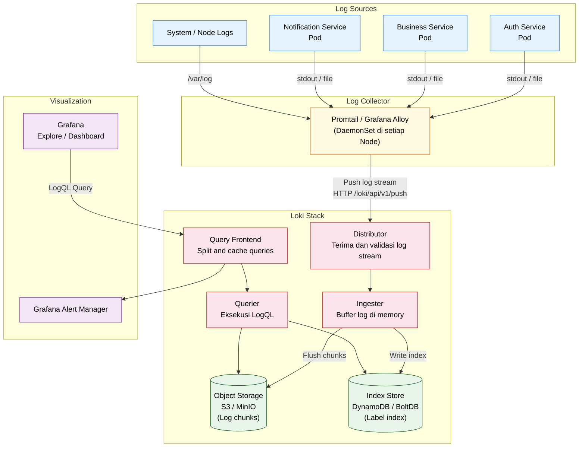
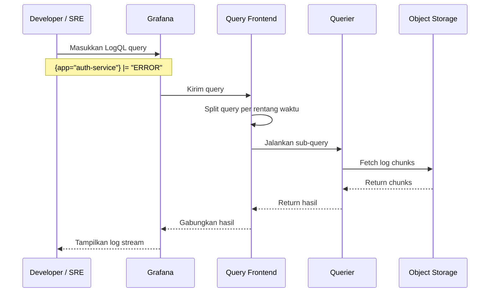

# Logging dengan Loki

**Grafana Loki** adalah sistem agregasi log yang didesain seperti Prometheus, namun untuk log. Loki tidak mengindeks isi log (seperti Elasticsearch), melainkan hanya mengindeks label/metadata-nya — sehingga jauh lebih hemat storage dan lebih cepat di-query.

---

## Konsep Dasar Loki

| Komponen | Fungsi |
|---|---|
| **Promtail / Alloy** | Agent yang mengumpulkan log dari file/container dan mengirimnya ke Loki |
| **Loki** | Server penyimpanan dan query log |
| **Grafana** | Antarmuka untuk memvisualisasikan log (menggunakan LogQL) |

**Prinsip utama**:
- Log disimpan dalam bentuk **stream** yang diidentifikasi oleh sekumpulan **label** (misalnya `app=auth-service, env=production`)
- Isi log **tidak diindeks**, hanya labelnya — sehingga ingestion sangat cepat
- Query menggunakan **LogQL**, sintaksnya mirip PromQL

---

## Diagram Topologi Logging Stack



---

## Diagram Alur Query LogQL



---

## Contoh Query LogQL

```logql
# Tampilkan semua log error dari auth-service
{app="auth-service", env="production"} |= "ERROR"

# Hitung rate error per menit
rate({app="auth-service"} |= "ERROR" [1m])

# Parse log JSON dan filter field tertentu
{app="business-service"} | json | status_code >= 500
```

---

## Best Practices

- Gunakan **label yang konsisten** dan tidak terlalu banyak (hindari high-cardinality label seperti `user_id` atau `request_id`)
- Deploy Promtail sebagai **DaemonSet** agar semua pod di setiap node ter-cover
- Atur **retention policy** di object storage (misalnya log lebih dari 30 hari dihapus)
- Gunakan **chunk encoding** (snappy) untuk efisiensi storage
