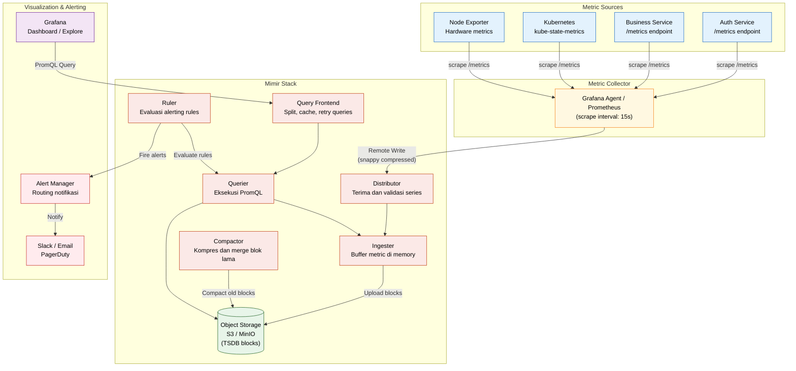
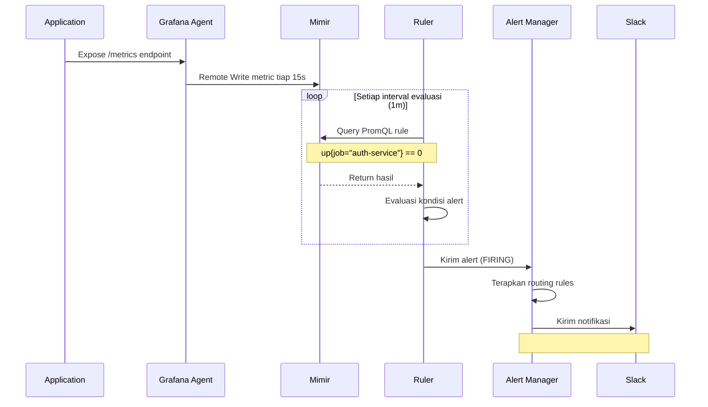
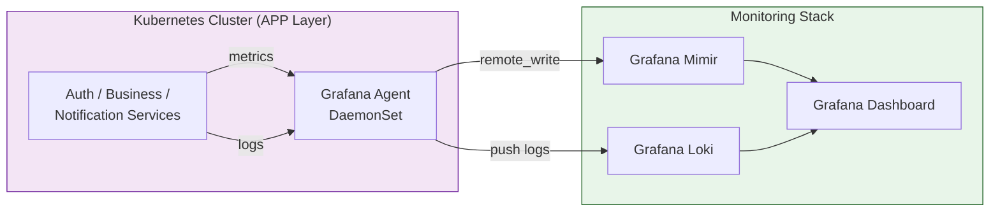

# Metric dengan Mimir

**Grafana Mimir** adalah backend time-series database yang kompatibel dengan Prometheus, dirancang untuk skala besar (multi-tenant, highly available). Mimir menyimpan metric yang dikumpulkan oleh Prometheus/Grafana Agent dan menyediakan query engine PromQL yang sangat cepat.

---

## Konsep Dasar Mimir

| Komponen | Fungsi |
|---|---|
| **Grafana Agent / Prometheus** | Mengumpulkan metric dari aplikasi/infrastruktur (scraping) |
| **Mimir** | Menerima, menyimpan, dan melayani query metric jangka panjang |
| **Grafana** | Antarmuka dashboard menggunakan PromQL |

**Keunggulan Mimir dibanding Prometheus standalone**:
- **Multi-tenant**: Satu cluster bisa melayani banyak tim
- **Horizontal scaling**: Setiap komponen bisa di-scale secara independen
- **Long-term storage**: Data metric disimpan di object storage (S3/GCS), tidak di disk lokal
- **High availability**: Tidak ada single point of failure

---

## Diagram Topologi Metric Stack



---

## Diagram Alur Alert (dari Metric ke Notifikasi)



---

## Contoh Query PromQL

```promql
# CPU usage per pod
rate(container_cpu_usage_seconds_total{namespace="production"}[5m])

# Memory usage
container_memory_usage_bytes{app="auth-service"} / 1024 / 1024

# Request rate per service
sum(rate(http_requests_total{status=~"5.."}[5m])) by (service)

# Uptime check
up{job="auth-service"} == 0
```

---

## Integrasi dengan Infrastruktur



---

## Best Practices

- Gunakan **recording rules** untuk query PromQL yang berat agar tidak dijalankan real-time
- Atur **retention** di object storage sesuai kebutuhan (misalnya 90 hari)
- Gunakan **Grafana Agent** daripada Prometheus jika sudah menggunakan Mimir dan Loki — satu agent untuk keduanya
- Pisahkan **alerting rules** antara tim (misal: tim infra vs tim aplikasi) menggunakan namespace di Ruler
