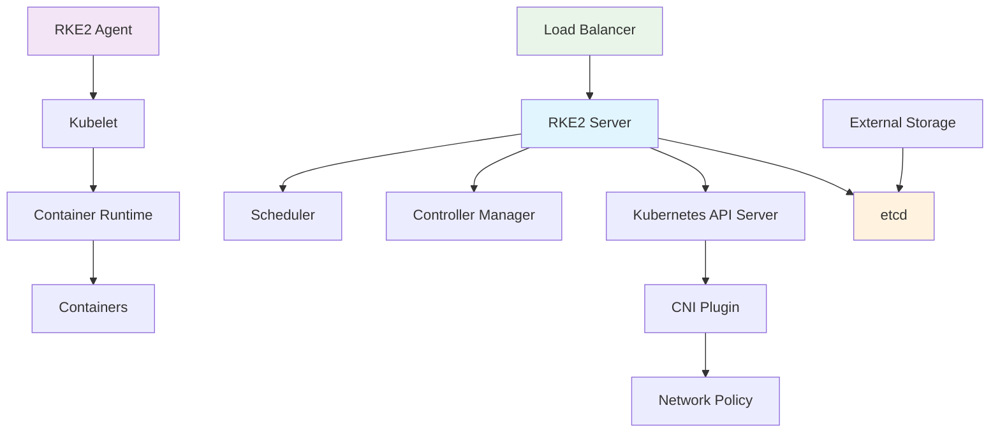

# RKE2

RKE2 (Rancher Kubernetes Engine 2) adalah distribusi Kubernetes yang ringan, aman, dan mudah di-deploy.

## Overview

RKE2 adalah distribusi Kubernetes yang dikembangkan oleh Rancher dengan fokus pada:
- **Security**: Built-in security features dan compliance
- **Simplicity**: Mudah diinstall dan dikonfigurasi
- **Performance**: Optimized untuk production workloads
- **Compatibility**: 100% compatible dengan upstream Kubernetes

## Fitur Utama

### Security Features
- **FIPS 140-2 Compliant**: Memenuhi standar keamanan federal
- **SELinux Support**: Enhanced security dengan SELinux
- **Secrets Encryption**: Enkripsi secrets di etcd
- **Audit Logging**: Comprehensive audit trails

### Performance Features
- **Lightweight**: Footprint yang lebih kecil dari RKE1
- **Optimized**: Optimized untuk performance
- **Scalable**: Mendukung cluster besar
- **Efficient**: Resource usage yang efisien

### Operational Features
- **Easy Installation**: One-command installation
- **Simple Configuration**: YAML-based configuration
- **Built-in Monitoring**: Integrated monitoring
- **Backup & Recovery**: Automated backup solutions

## Sub Tema

### [Installation Guide](./rke2/installation)
Panduan lengkap untuk menginstal RKE2 di berbagai environment:
- System requirements
- Installation methods
- Verification steps
- Troubleshooting

### [Configuration Guide](./rke2/configuration)
Panduan konfigurasi RKE2 untuk production:
- Network configuration
- Security settings
- Performance tuning
- Environment-specific configs

## Arsitektur RKE2



## Komponen Utama

### 1. RKE2 Server
- **API Server**: Kubernetes API endpoint
- **etcd**: Distributed key-value store
- **Controller Manager**: Manages cluster state
- **Scheduler**: Schedules pods to nodes

### 2. RKE2 Agent
- **Kubelet**: Node agent
- **Container Runtime**: containerd
- **CNI Plugin**: Network connectivity
- **CSI Plugin**: Storage integration

### 3. Add-ons
- **CoreDNS**: DNS service
- **Metrics Server**: Resource metrics
- **Ingress Controller**: Load balancing
- **Storage Classes**: Dynamic provisioning

## Use Cases

### Development Environment
- Local development clusters
- Testing and staging
- CI/CD pipelines
- Learning Kubernetes

### Production Environment
- Enterprise applications
- Microservices architecture
- High availability setups
- Multi-tenant environments

### Edge Computing
- IoT deployments
- Remote locations
- Limited connectivity
- Resource constraints

## Comparison dengan RKE1

| Feature | RKE1 | RKE2 |
|---------|------|------|
| Installation | Docker-based | Binary-based |
| Security | Basic | FIPS compliant |
| Performance | Standard | Optimized |
| Configuration | Complex | Simple |
| Maintenance | Manual | Automated |

## Getting Started

### Quick Start
```bash
# Install RKE2
curl -sfL https://get.rke2.io | sh -

# Start server
sudo systemctl enable rke2-server.service
sudo systemctl start rke2-server.service

# Get kubeconfig
sudo cat /etc/rancher/rke2/rke2.yaml
```

### Next Steps
1. **Install kubectl**: Set up command line tools
2. **Configure access**: Set up kubeconfig
3. **Deploy applications**: Start with simple apps
4. **Setup monitoring**: Install monitoring stack
5. **Configure backup**: Set up etcd backup

## Topik
- Apa itu RKE2
- Instalasi dasar
- Integrasi dengan Rancher 