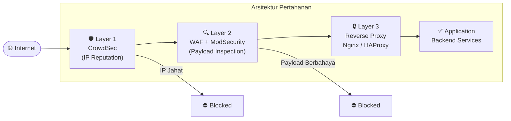

# Security

Dokumentasi ini membahas strategi **pertahanan berlapis (*Defense in Depth*)** untuk melindungi infrastruktur dan aplikasi web dari berbagai ancaman siber.

---

## Arsitektur Pertahanan Berlapis

---

## 📖 Sub Tema

| Sub Tema | Deskripsi |
|---|---|
| [WAF dengan HAProxy & ModSecurity](./security/waf-haproxy-modsecurity) | Membangun Web Application Firewall dengan HAProxy, ModSecurity SPOA, dan OWASP CRS |
| [CrowdSec & HAProxy](./security/crowdsec-haproxy) | Integrasi CrowdSec sebagai threat intelligence layer di HAProxy |
| [CrowdSec & Nginx Proxy Manager](./security/crowdsec-nginx) | Mengamankan Nginx Proxy Manager dengan CrowdSec Bouncer |
