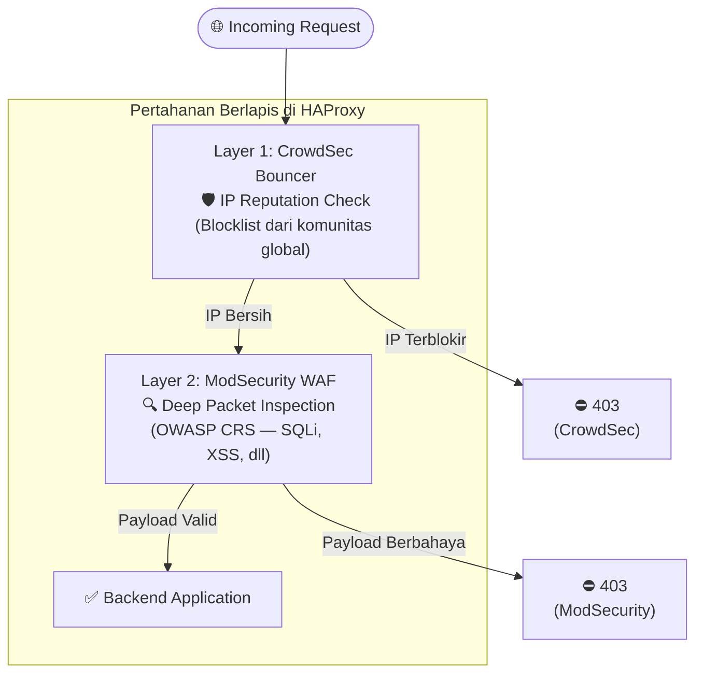
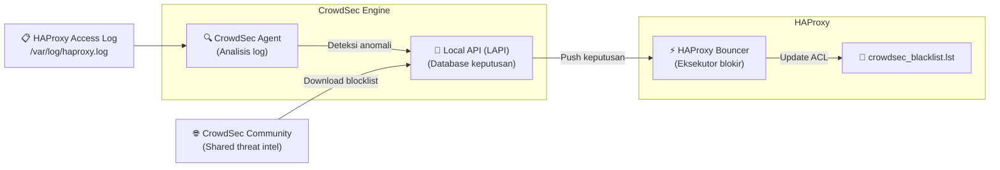

# Integrasi CrowdSec dengan HAProxy WAF

CrowdSec adalah sistem keamanan kolaboratif yang menganalisis log dan berbagi intelijen ancaman (*threat intelligence*) antar pengguna secara global. Dengan mengintegrasikannya di HAProxy, setiap IP berbahaya yang terdeteksi oleh komunitas CrowdSec akan otomatis diblokir sebelum mencapai aplikasi Anda.

---

## Arsitektur Pertahanan Berlapis



---

## Cara Kerja CrowdSec



---

## Konfigurasi HAProxy

### Frontend dengan Double Protection

```haproxy
frontend https-in
    bind *:443 ssl crt /etc/ssl/certs/site.pem

    # ─── Layer 1: CrowdSec IP Check ──────────────────────────────
    acl is_crowdsec_blocked src -f /etc/haproxy/crowdsec_blacklist.lst
    http-request deny deny_status 403 if is_crowdsec_blocked

    # ─── Layer 2: ModSecurity WAF ────────────────────────────────
    filter spoe engine modsecurity config /etc/haproxy/modsec.conf
    http-request deny if { var(txn.modsec.code) -m int gt 0 }

    default_backend web-servers
```

---

## Docker Compose Setup

```yaml
services:
  haproxy:
    image: haproxy:2.8
    ports:
      - "443:443"
    volumes:
      - ./haproxy.cfg:/usr/local/etc/haproxy/haproxy.cfg
      - ./crowdsec_blacklist.lst:/etc/haproxy/crowdsec_blacklist.lst

  crowdsec:
    image: crowdsecurity/crowdsec:latest
    environment:
      - COLLECTIONS=crowdsecurity/haproxy
    volumes:
      - /var/log/haproxy:/var/log/haproxy:ro
      - crowdsec_data:/var/lib/crowdsec/data
    ports:
      - "8080:8080" # LAPI port

  crowdsec-haproxy-bouncer:
    image: crowdsecurity/haproxy-bouncer:latest
    environment:
      - CROWDSEC_LAPI_URL=http://crowdsec:8080
      - CROWDSEC_LAPI_KEY=${BOUNCER_API_KEY}
      - UPDATE_FREQUENCY=10 # Update blacklist setiap 10 detik
    volumes:
      - ./crowdsec_blacklist.lst:/etc/haproxy/crowdsec_blacklist.lst

volumes:
  crowdsec_data:
```

---

## Perintah Manajemen CrowdSec

```bash
# Lihat daftar IP yang diblokir
cscli decisions list

# Blokir IP secara manual
cscli decisions add --ip 1.2.3.4 --duration 24h --reason "manual block"

# Hapus blokir IP
cscli decisions delete --ip 1.2.3.4

# Lihat alert yang terdeteksi
cscli alerts list

# Lihat status mesin (scenarios yang aktif)
cscli machines list

# Install koleksi rule untuk HAProxy
cscli collections install crowdsecurity/haproxy

# Update semua koleksi
cscli hub update && cscli hub upgrade
```

---

## Monitoring dengan cscli metrics

```bash
cscli metrics
```

Output contoh:

```
Acquisition Metrics:
  Source              | Lines read | Lines parsed | Lines unparsed
  /var/log/haproxy.log| 45,231     | 44,890       | 341

Scenario Metrics:
  Scenario                     | Current| Overflows| ...
  crowdsecurity/http-bf-wordpress | 12   | 8        | ...
  crowdsecurity/http-crawl-non_statics | 3 | 1    | ...
```

---

## Best Practices

- Daftarkan instance ke [CrowdSec Console](https://app.crowdsec.net/) untuk visibilitas terpusat
- Pasang koleksi yang relevan: `cscli collections install crowdsecurity/haproxy crowdsecurity/linux`
- Set `UPDATE_FREQUENCY` bouncer ke `10s`–`30s` untuk respons cepat
- Aktifkan notifikasi Slack/Email saat terjadi serangan besar melalui CrowdSec Console
