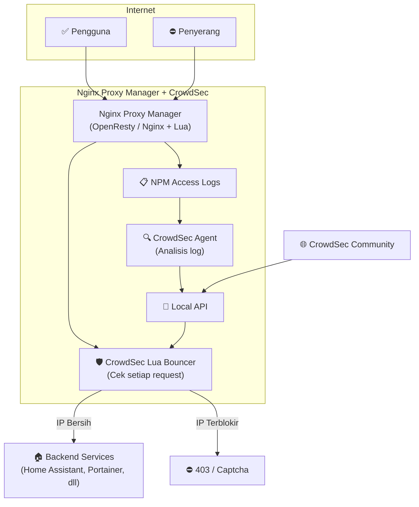
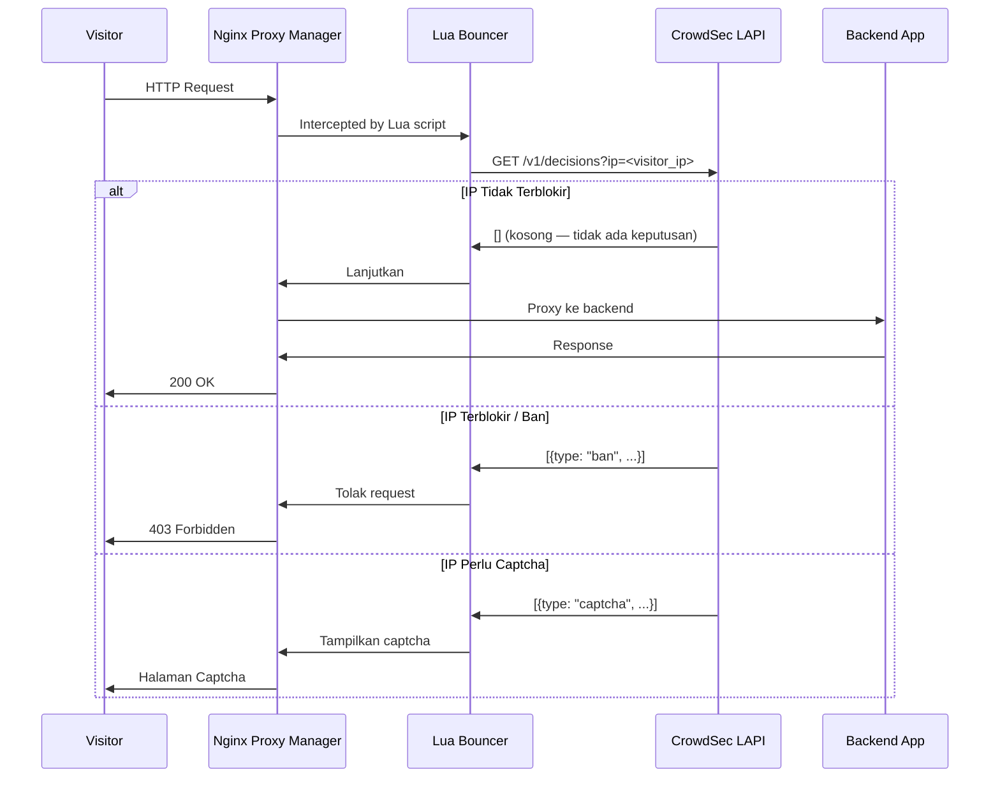

# Mengamankan Nginx Proxy Manager dengan CrowdSec

Nginx Proxy Manager (NPM) adalah solusi reverse proxy populer berbasis GUI yang memudahkan manajemen SSL dan routing. Namun secara bawaan NPM tidak memiliki proteksi aktif terhadap serangan. Panduan ini menjelaskan cara mengintegrasikan CrowdSec Bouncer ke dalam NPM untuk perlindungan real-time.

---

## Arsitektur Integrasi



---

## Alur Verifikasi Request



---

## Instalasi dan Konfigurasi

### 1. Docker Compose

```yaml
services:
  nginx-proxy-manager:
    image: jc21/nginx-proxy-manager:latest
    ports:
      - "80:80"
      - "443:443"
      - "81:81"   # Admin UI
    volumes:
      - npm_data:/data
      - letsencrypt:/etc/letsencrypt
      # Mount custom OpenResty config untuk CrowdSec Bouncer
      - ./crowdsec-bouncer.conf:/etc/nginx/conf.d/crowdsec-bouncer.conf

  crowdsec:
    image: crowdsecurity/crowdsec:latest
    environment:
      - COLLECTIONS=crowdsecurity/nginx
    volumes:
      - npm_data:/var/log/nginx:ro    # Baca log NPM
      - crowdsec_db:/var/lib/crowdsec/data
      - crowdsec_config:/etc/crowdsec

  crowdsec-nginx-bouncer:
    image: crowdsecurity/nginx-proxy-manager-bouncer:latest
    environment:
      - CROWDSEC_LAPI_URL=http://crowdsec:8080
      - CROWDSEC_LAPI_KEY=${BOUNCER_API_KEY}

volumes:
  npm_data:
  letsencrypt:
  crowdsec_db:
  crowdsec_config:
```

### 2. Daftarkan Bouncer dan Dapatkan API Key

```bash
# Masuk ke container CrowdSec
docker exec -it crowdsec bash

# Daftarkan bouncer baru
cscli bouncers add npm-bouncer

# Salin API key yang dihasilkan ke environment variable BOUNCER_API_KEY
```

---

## Cakupan Perlindungan

| Aspek | Tanpa CrowdSec | Dengan CrowdSec |
|---|---|---|
| SSL Otomatis | ✅ | ✅ |
| Reverse Proxy GUI | ✅ | ✅ |
| Blokir Brute Force | ❌ | ✅ |
| IP Reputation Global | ❌ | ✅ |
| Captcha Challenge | ❌ | ✅ |
| Proteksi Backend | ❌ | ✅ Semua layanan |

---

## Best Practices

- Gunakan koleksi `crowdsecurity/nginx` yang sudah dioptimalkan untuk log format NPM
- Aktifkan **captcha mode** untuk IP mencurigakan (bukan langsung ban) untuk mengurangi false positive
- Monitor dashboard CrowdSec Console secara berkala untuk melihat tren serangan
