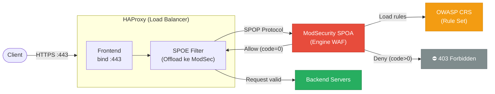
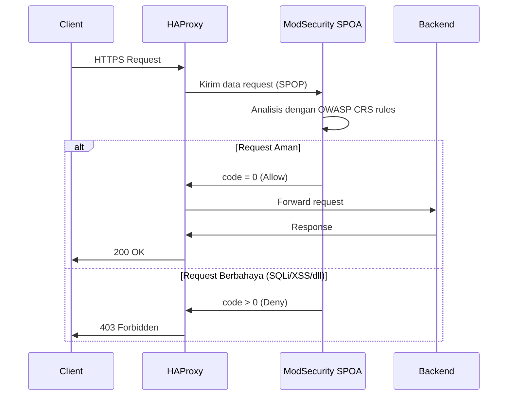

# Web Application Firewall dengan HAProxy, ModSecurity, dan OWASP CRS

Web Application Firewall (WAF) adalah lapisan keamanan yang menganalisis dan memfilter traffic HTTP/HTTPS untuk memblokir serangan sebelum mencapai aplikasi. Panduan ini membahas implementasi WAF menggunakan **HAProxy** sebagai load balancer, **ModSecurity SPOA** sebagai engine WAF, dan **OWASP Core Rule Set (CRS)** sebagai basis aturan keamanan.

---

## Arsitektur



---

## Komponen

| Komponen | Fungsi |
|---|---|
| **HAProxy** | Load balancer dan reverse proxy — pintu gerbang utama |
| **ModSecurity SPOA** | Agen WAF yang berjalan terpisah, menerima request dari HAProxy via SPOP |
| **OWASP CRS** | Kumpulan aturan keamanan yang mendeteksi SQLi, XSS, LFI, RFI, dan serangan lainnya |

---

## Alur Pemrosesan Request



---

## Konfigurasi HAProxy

```haproxy
frontend https-in
    bind *:443 ssl crt /etc/ssl/certs/site.pem

    # Kirim ke ModSecurity SPOA untuk dianalisis
    filter spoe engine modsecurity config /etc/haproxy/modsec.conf

    # Blokir jika ModSecurity menandai request berbahaya
    http-request deny if { var(txn.modsec.code) -m int gt 0 }

    default_backend web-servers

backend web-servers
    server app1 10.0.1.10:8080 check
    server app2 10.0.1.11:8080 check
```

## SPOE Configuration

```haproxy
[modsecurity]
spoe-agent modsecurity-agent
    messages    check-request
    option      var-prefix modsec
    timeout     hello      100ms
    timeout     idle       30s
    timeout     processing 500ms
    use-backend modsec-cluster

spoe-message check-request
    args method path query version headers payload

backend modsec-cluster
    server modsecurity 127.0.0.1:12345
```

---

## Docker Compose Setup

```yaml
services:
  haproxy:
    image: haproxy:2.8
    ports:
      - "443:443"
      - "80:80"
    volumes:
      - ./haproxy.cfg:/usr/local/etc/haproxy/haproxy.cfg
      - ./modsec.conf:/etc/haproxy/modsec.conf
      - ./certs:/etc/ssl/certs

  modsecurity-spoa:
    image: jcmoraisjr/modsecurity-spoa:latest
    ports:
      - "127.0.0.1:12345:12345"
    volumes:
      - ./owasp-crs:/etc/modsecurity.d/owasp-crs
    environment:
      - MODSECURITY_RULE_ENGINE=On
```

---

## Level Paranoia OWASP CRS

OWASP CRS memiliki 4 level paranoia — semakin tinggi, semakin ketat namun berpotensi lebih banyak false positive:

| Level | Karakteristik | Rekomendasi |
|---|---|---|
| **PL1** | Deteksi serangan umum, false positive sangat rendah | Titik awal untuk semua deployment |
| **PL2** | Perlindungan lebih komprehensif | Untuk aplikasi yang membutuhkan keamanan lebih |
| **PL3** | Deteksi serangan canggih | Untuk lingkungan sensitif |
| **PL4** | Keamanan maksimum | Lingkungan kritis — butuh tuning intensif |

---

## Best Practices

- Mulai dengan **PL1** dan monitor false positive selama 1-2 minggu sebelum menaikkan level
- Gunakan mode **DetectionOnly** terlebih dahulu, baru aktifkan **Prevention** setelah tuning
- Aktifkan logging untuk semua request yang diblokir guna analisis dan tuning rule
- Perbarui OWASP CRS secara rutin untuk mendapatkan proteksi terhadap serangan terbaru
